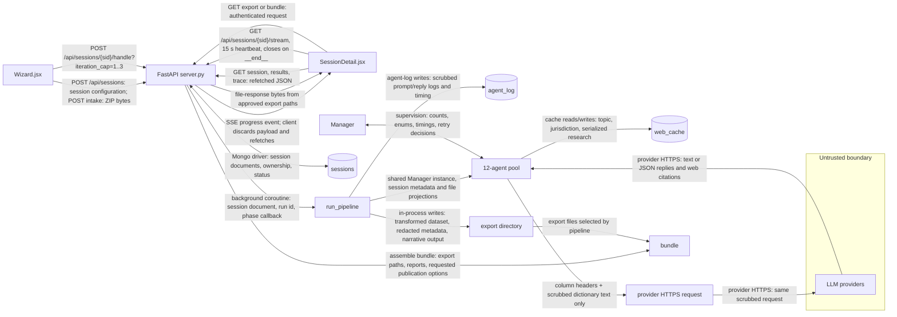
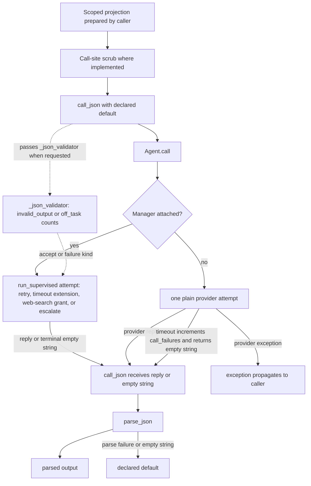

# PHI agent architecture

## Scope and how to read this

This document records the code-backed PHI pipeline, supervision, verification, and human-review architecture. The Code anchors table identifies the source symbols for claims developed in this document.

## System context (Level 0)

The browser clients create and upload sessions through FastAPI. `Wizard.jsx` starts a session run, while `SessionDetail.jsx` watches it and refetches session data after each SSE message. `server.py` stores session and trace data, starts `run_pipeline`, and makes exports and bundles available only through its HTTP routes. `scrub_for_prompt` at the Lexicon and Instrument call sites limits the text sent in those prompts. This is a named control, not a proof that every provider-bound prompt is value-free.

The handle request launches the pipeline with a valid `iteration_cap` from 1 through 3. Provider prompts vary by agent: the displayed projection is the Lexicon and Instrument data-bearing prompt boundary; Statute, Praxis, Scout, Ledger, Herald, and Manager use their narrower work inputs.

The SSE stream is a change notification, not a state transport. `SessionDetail.jsx` registers `onmessage = () => refresh()`, so the displayed session, results, and trace are fetched through HTTP after a message. `server.py` emits a comment heartbeat after 15 seconds without a queued event and ends the stream when the phase is `"__end__"`. Sources: Code anchors "SSE route" and "Session-detail SSE client".

## Agent census and roster table

The code defines 17 `Agent` subclasses plus 2 non-Agent driver classes, for 19 classes total. The roster has 12 agents: Lexicon, Schema, Instrument, Statute, Praxis, Judge, Sentinel, Executor, Auditor, Scout, Ledger, and Herald. Manager, Operator, and Reviewer are off-roster agents. Ledger.Compare, Ledger.Aggregate, Herald.Abstract, and Herald.Sections are subagents. Ledger and Herald are the two drivers that do not subclass `Agent`.

| Group | Classes | Invocation and LLM status |
| --- | --- | --- |
| Roster specialists and decision agents | Lexicon, Schema, Instrument, Statute, Praxis, Judge, Sentinel, Executor, Auditor, Scout | Constructed through the `run_pipeline` roster. Schema and Executor are non-LLM. Instrument calls an LLM only for tier-2 flat or scanned PDFs and `.docx`; AcroForm PDFs are read directly. |
| Roster drivers | Ledger, Herald | Non-Agent drivers that construct and coordinate their named subagents. |
| Off-roster stages | Manager, Operator, Reviewer | Manager supervises the run. Operator and Reviewer are non-LLM deterministic verification stages. |
| Ledger subagents | Ledger.Compare, Ledger.Aggregate | `Agent` subclasses constructed by Ledger. They generate comparisons, then the benchmark rollup. |
| Herald subagents | Herald.Abstract, Herald.Sections | `Agent` subclasses constructed by Herald and run concurrently for the two manuscript portions. |

Praxis skips an LLM call for deterministic categories A, D, F, and G. The counts treat the four subagents as `Agent` subclasses, while excluding the two drivers from that subclass count. Sources: Code anchors "Pipeline sequence", "Lexicon" through "Reviewer", and "Ledger and subagents" and "Herald and subagents".

## Orchestration loop (Level 1)

`run_pipeline` constructs one Manager, records its deterministic charter, and passes the same Manager in `common` to every constructed agent. It has no checkpoint object. The word "checkpoint" occurs only in the Reviewer-stage consult comment, not as a pipeline state or persisted object.

```mermaid
flowchart TB
    Start["run_pipeline"] --> Charter["Construct Manager and emit manager.charter"]
    Charter --> Common["common: session_id, llm, db, emit, one Manager"]

    subgraph Parallel["Parallel wave at t=0"]
        Statute["Statute: jurisdiction rules"]
        Praxis["Praxis.method_for for 17 HIPAA categories"]
        Specialists["Lexicon, Schema, Instrument"]
        Empty["_empty columns or fields when file kind is absent"]
        Specialists --- Empty
    end
    Common --> Statute
    Common --> Praxis
    Common --> Specialists
    Statute --> ExpertJoin["await Statute and Praxis"]
    Praxis --> ExpertJoin
    Specialists --> Attach["attach Lexicon, Schema, Instrument to Manager"]
    ExpertJoin --> PraxisFailures["log praxis.category_failed; Judge falls back for that category"]

    subgraph Loop["Judge and Sentinel loop"]
        Judge["Judge"]
        Validate["validate_decisions"]
        HardRules["hard rules, age/DOB, site-cardinality, anti-loop, confidence floor"]
        Sentinel["Sentinel"]
        Escalate["apply Sentinel escalations and count blocking issues"]
        BlockingFloor["apply_blocking_floor; summarise feedback"]
        Reiteration{"iteration < max_iterations?"}
        Consult["Manager consult"]
        Judge --> Validate --> HardRules --> Sentinel --> Escalate --> BlockingFloor
        BlockingFloor -->|"no blocking issues, break at orchestrator.py:405"| PostLoop
        BlockingFloor -->|"iteration >= iteration_cap and every blocking column hit the floor, :406-419"| PostLoop
        BlockingFloor -->|"blocking issues remain"| Reiteration
        Reiteration -->|"iteration >= max_iterations, post-loop exit"| PostLoop
        Reiteration -->|"iteration < max_iterations"| Consult
        Consult -->|"continue; blocking issues remain and iteration < max(iteration_cap, 3)"| Judge
    end
    Attach --> Judge
    PraxisFailures --> Judge

    PostLoop["scrub_decision; verify_keep_decisions; annotate_pending_review; scrub Sentinel report"] --> HumanGate{"Human-review gate"}
    Consult -->|"manager.consult returned escalate_human_review, :430-432"| HumanGate
    HumanGate -->|"any decision action == human_review, or call_failures, or empty decisions, or blocking after cap, or manager early escalation"| Pause["persist and Manager.escalate_to_human_review"]
    Pause -->|"tail only, Executor onward, new _pipeline_run_id"| Executor
    HumanGate -->|"no human-review predicate"| Executor["Executor; persist reversal_key_blob separately"]
    Executor --> Scout["start Scout background task"]
    Executor --> Operator

    subgraph Verification["Execution and verification"]
        Operator["Operator"]
        OperatorDrop["file dropped from exports, final_status = partially_complete"]
        Reviewer["Reviewer replaces exports with filtered view"]
        ReviewerConsult["advisory Manager consult for Reviewer"]
        Operator --> OperatorDrop --> Reviewer --> ReviewerConsult
    end
    ReviewerConsult -->|"coverage advisory escalation"| Pause

    subgraph Publish["Publish gate"]
        Guard["scan_all_exports"]
        Blocked["close_run blocked; cancel Scout; return"]
        ReviewerConsult --> Guard
        Guard -->|"status != clean -> blocked, run ends"| Blocked
    end

    subgraph Outward["Outward agents and closeout"]
        AuditScout["gather Auditor and Scout"]
        AuditAdvice["Manager Auditor consult; deterministic confidence gate; materialize disagreements"]
        Ledger["Ledger"]
        Herald["Herald"]
        Complete["close_run; persist completion; cleanup only when complete"]
        Guard -->|"clean"| AuditScout
        Scout --> AuditScout
        AuditScout --> AuditAdvice
        AuditAdvice -->|"human review required"| Pause
        AuditAdvice -->|"no escalation"| Ledger --> Herald --> Complete
    end
```

The loop performs the listed deterministic transformations before Sentinel sees the decisions. A Sentinel escalation routes an ambiguous column to human review; the blocking floor tracks repeated blocking issues independently of the requested `iteration_cap`. The Manager consult does not replace those gates. Sources: Code anchors "Pipeline sequence" and "Deterministic gates".

## Inside one agent (Level 2) and the per-agent contract

This level shows the `call_json` path used by LLM-backed agents. Schema, Executor, Operator, and Reviewer do not take this path because their `PROMPT` is empty and their work is deterministic.

`Agent.call` logs scrubbed prompt and reply text to `agent_log`, but it passes its original `user_prompt` to the provider. The effective outbound control is therefore any caller-specific scrub, such as Lexicon's dictionary-row scrub and Instrument's tier-2 form-text scrub. Only `call_json` applies `parse_json` and its declared default after a reply or an empty string. An unmanaged `Agent.call` timeout returns `""`; an unmanaged provider exception propagates. A supervised terminal failure returns `""` after Manager exhaustion. Sources: Code anchors "Base agent", "Prompt scrubbing call sites", and "Manager".

### Per-agent contracts

#### Lexicon

- Indexes every documented dictionary row with a nonblank name, asks for gists in batches, and returns `{"columns": [...], "notes": ""}`.
- Reads dictionary files, then sends only one or more already-scrubbed dictionary rows to an LLM. A guardian query reads only that indexed column row.
- Returns column entries with `name`, `description`, `phi_flag_hint`, `clinical_utility`, and `notes`; guardian answers have `verdict`, `explanation`, and `citation`.
- Logs a `lexicon.blank_name` skip for blank-name rows. A missing or short gist reply leaves a nonblank row's gist blank; an absent guardian query returns `not_in_dictionary`, and an invalid reply becomes `corrected` with empty explanation and citation.

Source: Code anchors "Lexicon".

#### Schema

- Reads dataset headers and column statistics, then returns `{"columns": [{"name": ..., "_file_id": ...}]}`.
- Uses dataset file metadata and headers, with in-process column-value statistics; it makes no LLM call.
- Returns `columns`; `verify` returns `present` and `file_id`, or `present: false` with `explanation`; `cardinality` returns stored statistics or `{}`.
- Logs `schema.error` and contributes no column when headers are absent. Reader or statistics errors become empty header or statistics results.

Source: Code anchors "Schema".

#### Instrument

- Indexes fields collected by forms and returns `{"fields": [...]}`.
- Reads AcroForm field names directly. Flat or scanned PDF and `.docx` form text is truncated, rule-scrubbed, and sent to the LLM.
- Returns fields with `label` and `collected_variable`; `verify` returns `present`, `file_id`, and `field`, or `present: false` with `explanation`.
- Uses `{"fields": []}` as the tier-2 LLM default. AcroForm read failures fall through to tier 2 rather than inventing fields.

Source: Code anchors "Instrument".

#### Statute

- Produces the jurisdiction rulebook and adjacent-regime advisory rows.
- Uses jurisdiction, the deterministic regulation pack, cached research, and provider-hosted web-search results. It does not receive study files or row values.
- Returns `jurisdiction`, `regulation`, `citation`, `identifier_categories`, `handling_rules`, `age_aggregation_threshold`, `as_of`, `sources`, and `adjacent_regimes`.
- Uses `_pack_fallback` after failed HIPAA research; invalid or failed adjacent-regime research uses the deterministic five-row fallback for the US.

Source: Code anchors "Statute".

#### Praxis

- Returns candidate transformation methods for one HIPAA category, or a `methods` map when run over a list.
- Uses a category and its deterministic US regulation-pack description, cached research, and web-search results. It does not receive session data values.
- Returns `category`, `methods`, and `as_of`; method entries include `name`, `how_to_apply`, `why`, `params`, `utility_preserving`, `clinical_impact`, `reference_paper`, and `sources`.
- Uses deterministic methods without an LLM for categories A, D, F, and G. Other failures use `_fallback(category)`, whose unknown-category method removes the identifier column.

Source: Code anchors "Praxis".

#### Judge

- Chooses one handling action for each dataset column and, for comments, interprets one reviewer instruction.
- Uses Statute rules, Schema headers, Instrument fields, Lexicon entries, a summarized Praxis method list, and prior Sentinel feedback. Its prompt states that it never sees row values.
- Returns `decisions`, each with `file_id`, `column`, `phi_category`, `subject`, `action`, `reason`, `confidence`, and `citation`. `resolve_comment` returns `action`, `reason`, and `confidence`.
- Uses `{"decisions": []}` as the `run` default. `resolve_comment` defaults to `{"action": "human_review", "reason": "", "confidence": 0.0}`.

Source: Code anchors "Judge".

#### Sentinel

- Reviews Judge decisions and reports whether they are approved or need revision.
- Uses Judge decisions, Statute rules, and Instrument fields. It receives no dataset rows.
- Returns `verdict`, `issues`, and `summary`; each issue has `file_id`, `column`, `problem`, `suggested_action`, and `severity`.
- Defaults to `{"verdict": "approved", "issues": []}`. After the call, an output with no blocking or escalate issue is forced to `approved`; pipeline call-failure counting separately routes a Sentinel failure to human review.

Source: Code anchors "Sentinel" and "Pipeline sequence".

#### Executor

- Applies settled actions, writes output files, and returns `exports`, `pseudonym_count`, and optional `reversal_key_blob`.
- Reads source file values in process, the decision list, and optional omitted columns. It makes no LLM call.
- Returns an `exports` mapping from `file_id` to path, `pseudonym_count` for registry size, and `reversal_key_blob` when pseudonymization created entries.
- Raises `ValueError` for an unresolved `human_review` decision. Per-file write or narrative-read failures omit or write a withheld placeholder export instead of returning the source content.

Source: Code anchors "Executor".

#### Auditor

- Independently re-derives expected actions and reports final audit findings and metrics.
- Uses per-column names, categories, actions, per-file counts, regulation text, Praxis methods, file metadata, and export IDs. It explicitly excludes row values.
- Returns `verdict`, `issues`, `metrics`, `confidence`, and `summary`.
- Defaults to `{"verdict": "issues", "issues": [], "metrics": {}, "confidence": 0.0, "summary": "Auditor call failed; treated as below the confidence floor."}`. An exception gathered by the pipeline becomes an `issues` verdict, empty metrics, and confidence `0.0`.

Source: Code anchors "Auditor" and "Pipeline sequence".

#### Scout

- Compiles a competitive landscape for later benchmark reporting.
- Uses the cache or an LLM prompt about external PHI systems. It receives no session file projection.
- Returns `systems` and `summary`; each system records `name`, `kind`, `vendor`, `strengths`, `weaknesses`, `reads_row_values`, and `citation`.
- Defaults to `{"systems": [], "summary": ""}`. A Scout exception gathered by the pipeline becomes `{}`.

Source: Code anchors "Scout" and "Pipeline sequence".

#### Ledger

- Coordinates comparison and rollup subagents, then merges their output into a benchmark report.
- Reduces decisions in process to action counts; it passes Auditor metrics and at most eight Scout systems to Ledger.Compare, then those comparisons to Ledger.Aggregate.
- Returns `headline`, `our_system`, `comparisons`, `metrics_narrative`, `recommendations`, and `benchmark_result`.
- Has no standalone declared default. Subagent defaults can produce empty strings, lists, and objects; if `our_system` is absent from aggregate output, Ledger uses deterministic action counts.

Source: Code anchors "Ledger and subagents".

#### Herald

- Coordinates two manuscript drafting subagents and merges their sections.
- Gives both subagents Ledger output, Auditor output, and the target venue. It does not receive row values.
- Returns `title`, `abstract`, `sections`, `references`, `target_venue`, and `alt_venues`.
- Has no standalone declared default. If a subagent raises, it substitutes that half's empty default and preserves the other half's output.

Source: Code anchors "Herald and subagents".

#### Manager

- Opens a charter, supervises LLM attempts, records consult advice, brokers guardian queries, escalates to human review, and closes a run report.
- Uses fixed roles plus counts, enums, timings, and owed/delivered integers for supervision. Guardian broker calls receive a column or field name only to forward it to Schema, Instrument, or Lexicon.
- Returns charter keys `opened_at`, `max_attempts`, `phase_plan`, and `assignments`; supervision returns a reply, success flag, and the original `error_kind`; closeout reports outcome, phase and intervention counts, bounded histories, reused coaching, and escalation.
- Logs `action: "escalate"` and `reason: "attempts_exhausted"` on a third failed supervised attempt, while returning its original error kind with no reply. `_decide` failures or illegal actions use the caller's default; `consult` defaults to `continue`.

Source: Code anchors "Manager" and "Base agent".

#### Operator

- Re-reads Executor's written outputs and checks decision completeness and action-specific output shapes.
- Uses in-process source and export values, file metadata, decisions, exports, and omitted columns. It makes no LLM call and does not place raw values in a verdict.
- Returns `verdicts`, `failed_file_ids`, and `status`; verdicts include file and column identity, violation metadata, method, checks, verdict, problem, and performed.
- Produces a `fail` verdict for a missing or unreadable export, missing decision, failed shape check, or unknown action; status is `issues` if any verdict fails or a file is unreadable.

Source: Code anchors "Operator".

#### Reviewer

- Reopens exports to audit whether Operator covered decisions, whether omitted columns leaked, and whether coverage counts agree; it filters blocked exports.
- Uses decisions, Operator results, export paths, and optional omitted columns. It reads written export values in process but logs only identifiers, counts, and template text.
- Returns `findings`, `status`, `coverage`, and filtered `exports`; coverage has `decisions`, `verdicts`, and `missing`.
- Treats an Operator-failed file as `issues` and filters it. A Reviewer exception is caught by the pipeline as `{"exports": {}, "findings": []}`, which removes all currently eligible exports.

Source: Code anchors "Reviewer" and "Pipeline sequence".

#### Ledger.Compare

- Writes one delta note per competitor against Auditor metrics.
- Uses Auditor metrics and no more than eight Scout competitor summaries.
- Returns `comparisons`, with `competitor`, `reads_row_values`, and `delta_notes`.
- Defaults to `{"comparisons": []}`.

Source: Code anchors "Ledger and subagents".

#### Ledger.Aggregate

- Produces the benchmark headline, system narrative, and recommendations.
- Uses deterministic decision counts, Auditor metrics, and Ledger.Compare output.
- Returns `headline`, `our_system`, `metrics_narrative`, and `recommendations`.
- Defaults to an empty headline, system object, narrative, and recommendations.

Source: Code anchors "Ledger and subagents".

#### Herald.Abstract

- Drafts title, abstract, methods, and references.
- Uses the Ledger headline and narrative, Auditor summary, and target venue.
- Returns `title`, `abstract`, `methods`, and `references`.
- Defaults to an empty title and abstract, an empty Methods body, and no references.

Source: Code anchors "Herald and subagents".

#### Herald.Sections

- Drafts results, discussion, limitations, conclusion, and alternative venues.
- Uses Ledger comparisons, Auditor metrics, and target venue.
- Returns `sections` and `alt_venues`.
- Defaults to `{"sections": [], "alt_venues": []}`.

Source: Code anchors "Herald and subagents".

## Manager supervision (Level 3)

`Manager` supervises agent calls and records run-level decisions.

## Operator and Reviewer coverage audit (Level 4)

`Operator` and `Reviewer` are deterministic audit stages that examine written exports and coverage.

## Human review (Level 5)

The review interface and its supporting HTTP layer are identified in the Code anchors table.

## PHI boundary and what it does and does not prove

The implementation defines the prompt, export, and review boundaries. This document distinguishes named controls from properties that code alone does not establish.

## Failure and escalation matrix

Failure handling and escalation behavior are defined by the pipeline driver, base agent, Manager, and deterministic gates.

## Tunables reference

Configuration and fixed bounds are documented from their current source definitions.

## Code anchors

| Concept | File | Symbol | Current line |
| --- | --- | --- | --- |
| Pipeline driver | `backend/phi_core/agents/orchestrator.py` | `run_pipeline` | 96 |
| Base agent | `backend/phi_core/agents/base.py` | `Agent` | 72 |
| Manager | `backend/phi_core/agents/manager.py` | `Manager` | 26 |
| Judge | `backend/phi_core/agents/reasoning.py` | `Judge` | 874 |
| Sentinel | `backend/phi_core/agents/reasoning.py` | `Sentinel` | 985 |
| Executor | `backend/phi_core/agents/reasoning.py` | `Executor` | 1065 |
| Auditor | `backend/phi_core/agents/reasoning.py` | `Auditor` | 1257 |
| Deterministic gates | `backend/phi_core/agents/reasoning.py` | `validate_decisions`; `apply_sentinel_hard_rules`; `apply_age_dob_rule`; `apply_site_cardinality_rule`; `apply_confidence_floor`; `apply_blocking_floor`; `apply_sentinel_escalations`; `verify_keep_decisions` | 41; 366; 447; 522; 585; 629; 675; 717 |
| Lexicon | `backend/phi_core/agents/specialists.py` | `Lexicon` | 34 |
| Schema | `backend/phi_core/agents/specialists.py` | `Schema` | 261 |
| Instrument | `backend/phi_core/agents/specialists.py` | `Instrument` | 340 |
| Statute | `backend/phi_core/agents/experts.py` | `Statute` | 30 |
| Praxis | `backend/phi_core/agents/experts.py` | `Praxis` | 320 |
| Scout | `backend/phi_core/agents/outward.py` | `Scout` | 18 |
| Ledger and subagents | `backend/phi_core/agents/outward.py` | `LedgerCompare`; `LedgerAggregate`; `Ledger` | 47; 69; 95 |
| Herald and subagents | `backend/phi_core/agents/outward.py` | `HeraldAbstract`; `HeraldSections`; `Herald` | 144; 171; 198 |
| Operator | `backend/phi_core/agents/operator.py` | `Operator` | 236 |
| Reviewer | `backend/phi_core/agents/reviewer.py` | `Reviewer` | 34 |
| Provider calls and JSON parse | `backend/phi_core/agents/llm.py` | `call_llm`; `parse_json` | 210; 221 |
| Batching | `backend/phi_core/agents/batching.py` | `run_batched` | 14 |
| Web cache | `backend/phi_core/agents/cache.py` | `REFRESH_DAYS`; `cache_get`; `cache_put` | 13; 16; 26 |
| Publish guard | `backend/phi_core/publish_guard.py` | `scan_all_exports` | 302 |
| Session statuses | `backend/phi_core/models.py` | `SessionStatus` | 23 |
| HTTP layer | `backend/server.py` | `app` | 126 |
| Review UI | `frontend/src/pages/SessionDetail.jsx` | `SessionDetail` | 623 |
| Launcher UI | `frontend/src/pages/Wizard.jsx` | `Wizard` | 528 |
| API client | `frontend/src/lib/api.js` | `API` | 4 |
| Pipeline sequence | `backend/phi_core/agents/orchestrator.py` | `run_pipeline` | 150-766 |
| SSE route | `backend/server.py` | `session_stream` | 721-772 |
| Handle route | `backend/server.py` | `session_handle` | 1736 |
| Session-detail SSE client | `frontend/src/pages/SessionDetail.jsx` | `SessionDetail` stream effect | 725-729 |
| Wizard pipeline launch | `frontend/src/pages/Wizard.jsx` | `runPipeline` | 546-559 |
| Prompt scrubbing call sites | `backend/phi_core/agents/specialists.py` | `Lexicon.run`; `Instrument.run` | 91; 388 |

## Documented intent versus current code

This section records divergences between architecture descriptions and current source when they are established from code.
