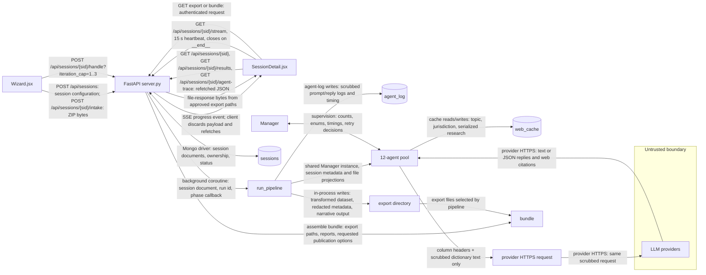
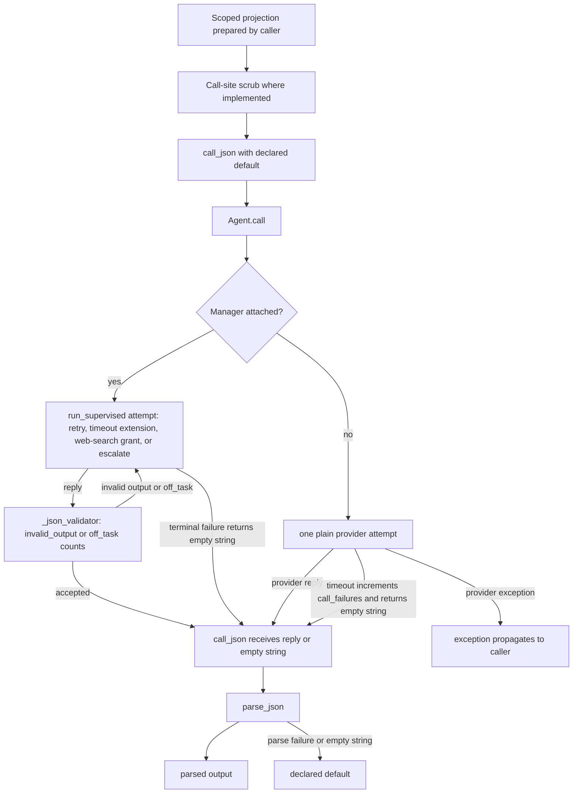
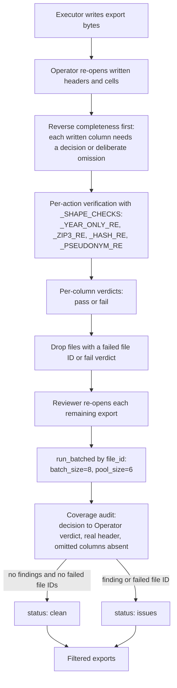
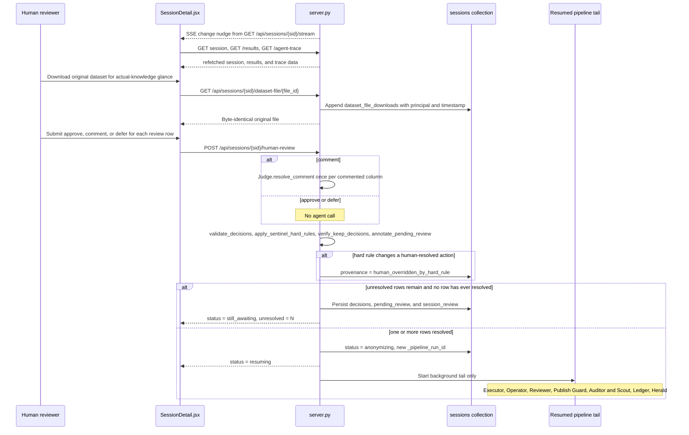
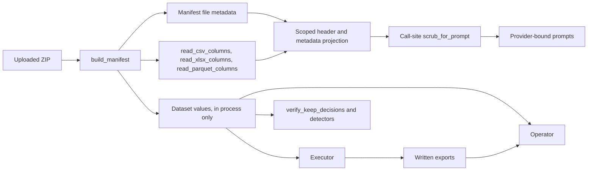

# PHI agent architecture

## Scope and how to read this

This document records the code-backed PHI pipeline, supervision, verification, and human-review architecture. The Code anchors table identifies the source symbols for claims developed in this document.

## System context (Level 0)

The browser clients create and upload sessions through FastAPI. `Wizard.jsx` starts a session run, while `SessionDetail.jsx` watches it and refetches session data after each SSE message. `server.py` stores session and trace data, starts `run_pipeline`, and makes exports and bundles available only through its HTTP routes. `scrub_for_prompt` at the Lexicon and Instrument call sites limits the text sent in those prompts. This is a named control, not a proof that every provider-bound prompt is value-free.



The handle request launches the pipeline with a valid `iteration_cap` from 1 through 3. Provider prompts vary by agent: the displayed projection is the Lexicon and Instrument data-bearing prompt boundary; Statute, Praxis, Scout, Ledger, Herald, and Manager use their narrower work inputs.

The SSE stream is a change notification, not a state transport. `SessionDetail.jsx` registers `onmessage = () => refresh()`, so the displayed session, results, and trace are fetched through HTTP after a message. `server.py` emits a comment heartbeat after 15 seconds without a queued event and ends the stream when the phase is `"__end__"`. Sources: Code anchors "SSE route" and "Session-detail SSE client".

## Agent census and roster table

The code defines 17 `Agent` subclasses plus 2 non-Agent driver classes, for 19 classes total. The roster has 12 agents: Lexicon, Schema, Instrument, Statute, Praxis, Judge, Sentinel, Executor, Auditor, Scout, Ledger, and Herald. Manager, Operator, and Reviewer are off-roster agents. Ledger.Compare, Ledger.Aggregate, Herald.Abstract, and Herald.Sections are subagents. Ledger and Herald are the two drivers that do not subclass `Agent`.

| Group | Classes | Invocation and LLM status |
| --- | --- | --- |
| Roster specialists and decision agents | Lexicon, Schema, Instrument, Statute, Praxis, Judge, Sentinel, Executor, Auditor, Scout | Constructed through the `run_pipeline` roster. Schema and Executor are non-LLM. Instrument calls an LLM only for tier-2 flat or scanned PDFs and `.docx`; AcroForm PDFs are read directly. |
| Roster drivers | Ledger, Herald | Non-Agent drivers that construct and coordinate their named subagents. |
| Off-roster stages | Manager, Operator, Reviewer | Manager supervises the run. Operator and Reviewer are non-LLM deterministic verification stages. |
| Ledger subagents | Ledger.Compare, Ledger.Aggregate | `Agent` subclasses constructed by Ledger. They generate comparisons, then the benchmark rollup. |
| Herald subagents | Herald.Abstract, Herald.Sections | `Agent` subclasses constructed by Herald and run concurrently for the two manuscript portions. |

Praxis skips an LLM call for deterministic categories A, D, F, and G. The counts treat the four subagents as `Agent` subclasses, while excluding the two drivers from that subclass count. Sources: Code anchors "Pipeline sequence", "Lexicon" through "Reviewer", and "Ledger and subagents" and "Herald and subagents".

## Orchestration loop (Level 1)

`run_pipeline` constructs one Manager, records its deterministic charter, and passes the same Manager in `common` to every constructed agent. It has no checkpoint object. The word "checkpoint" occurs only in the Reviewer-stage consult comment, not as a pipeline state or persisted object.

```mermaid
flowchart TB
    Start["run_pipeline"] --> Charter["Construct Manager and emit manager.charter"]
    Charter --> Common["common: session_id, llm, db, emit, one Manager"]

    subgraph Parallel["Parallel wave at t=0"]
        Statute["Statute: jurisdiction rules"]
        Praxis["Praxis.method_for for 17 HIPAA categories"]
        Specialists["Lexicon, Schema, Instrument"]
        Empty["_empty columns or fields when file kind is absent"]
        Specialists --- Empty
    end
    Common --> Statute
    Common --> Praxis
    Common --> Specialists
    Specialists --> Attach["attach Lexicon, Schema, Instrument to Manager"]
    Statute --> ExpertJoin["await Statute and Praxis"]
    Praxis --> ExpertJoin
    ExpertJoin --> PraxisFailure{"any Praxis category failure?"}
    PraxisFailure -->|"yes"| PraxisFailures["log praxis.category_failed; Judge falls back for that category"]
    PraxisFailure -->|"no"| Judge

    subgraph Loop["Judge and Sentinel loop"]
        Judge["Judge"]
        Validate["validate_decisions"]
        HardRules["hard rules, age/DOB, site-cardinality, anti-loop, confidence floor"]
        Sentinel["Sentinel"]
        Escalate["apply Sentinel escalations and count blocking issues"]
        BlockingFloor["apply_blocking_floor; summarise feedback"]
        Reiteration{"iteration < max_iterations?"}
        Consult["Manager consult"]
        Judge --> Validate --> HardRules --> Sentinel --> Escalate --> BlockingFloor
        BlockingFloor -->|"no blocking issues, break at orchestrator.py:405"| PostLoop
        BlockingFloor -->|"iteration >= iteration_cap and every blocking column hit the floor, :406-419"| PostLoop
        BlockingFloor -->|"blocking issues remain"| Reiteration
        Reiteration -->|"iteration >= max_iterations, post-loop exit"| PostLoop
        Reiteration -->|"iteration < max_iterations"| Consult
        Consult -->|"continue; blocking issues remain and iteration < max(iteration_cap, 3)"| Judge
    end
    Attach --> Judge
    PraxisFailures --> Judge

    PostLoop["scrub_decision; verify_keep_decisions; annotate_pending_review; scrub Sentinel report"] --> HumanGate{"Human-review gate"}
    Consult -->|"manager.consult returned escalate_human_review, :430-432"| HumanGate
    HumanGate -->|"any decision action == human_review, or call_failures, or empty decisions, or blocking after cap, or manager early escalation"| Pause["persist and Manager.escalate_to_human_review"]
    Pause -->|"tail only, Executor onward, new _pipeline_run_id"| Executor
    HumanGate -->|"no human-review predicate"| Executor["Executor; persist reversal_key_blob separately"]
    Executor --> Scout["start Scout background task"]
    Executor --> Operator

    subgraph Verification["Execution and verification"]
        Operator["Operator"]
        OperatorFilter{"op_failed_ids?"}
        DropFailed["drop failed files from exports"]
        Reviewer["Reviewer replaces exports with filtered view"]
        Status{"op_failed_ids or reviewer_blocked_ids?"}
        Partial["final_status = partially_complete"]
        CompleteStatus["final_status = complete"]
        ReviewerConsult["advisory Manager consult for Reviewer"]
        Operator --> OperatorFilter
        OperatorFilter -->|"yes"| DropFailed --> Reviewer
        OperatorFilter -->|"no"| Reviewer
        Reviewer --> Status
        Status -->|"yes"| Partial --> ReviewerConsult
        Status -->|"no"| CompleteStatus --> ReviewerConsult
    end
    ReviewerConsult -->|"coverage advisory escalation"| Pause

    subgraph Publish["Publish gate"]
        Guard["scan_all_exports"]
        Blocked["close_run blocked; cancel Scout; return"]
        ReviewerConsult --> Guard
        Guard -->|"status != clean -> blocked, run ends"| Blocked
    end

    subgraph Outward["Outward agents and closeout"]
        AuditScout["gather Auditor and Scout"]
        AuditAdvice["Manager Auditor consult; deterministic confidence gate; materialize disagreements"]
        Ledger["Ledger"]
        Herald["Herald"]
        Complete["close_run; persist completion; cleanup only when complete"]
        Guard -->|"clean"| AuditScout
        Scout --> AuditScout
        AuditScout --> AuditAdvice
        AuditAdvice -->|"human review required"| Pause
        AuditAdvice -->|"no escalation"| Ledger --> Herald --> Complete
    end
```



The loop performs the listed deterministic transformations before Sentinel sees the decisions. A Sentinel escalation routes an ambiguous column to human review; the blocking floor tracks repeated blocking issues independently of the requested `iteration_cap`. The Manager consult does not replace those gates. Sources: Code anchors "Pipeline sequence" and "Deterministic gates".

## Inside one agent (Level 2) and the per-agent contract

This level shows the `call_json` path used by LLM-backed agents. Schema, Executor, Operator, and Reviewer do not take this path because their `PROMPT` is empty and their work is deterministic.



`Agent.call` logs scrubbed prompt and reply text to `agent_log`, but it passes its original `user_prompt` to the provider. The effective outbound control is therefore any caller-specific scrub, such as Lexicon's dictionary-row scrub and Instrument's tier-2 form-text scrub. Only `call_json` applies `parse_json` and its declared default after a reply or an empty string. An unmanaged `Agent.call` timeout returns `""`; an unmanaged provider exception propagates. A supervised terminal failure returns `""` after Manager exhaustion. Sources: Code anchors "Base agent", "Prompt scrubbing call sites", and "Manager".

### Per-agent contracts

#### Lexicon

- Indexes every documented dictionary row with a nonblank name, asks for gists in batches, and returns `{"columns": [...], "notes": ""}`.
- Reads dictionary files, then sends only one or more already-scrubbed dictionary rows to an LLM. A guardian query reads only that indexed column row.
- Returns column entries with `name`, `description`, `phi_flag_hint`, `clinical_utility`, and `notes`; guardian answers have `verdict`, `explanation`, and `citation`.
- Logs a `lexicon.blank_name` skip for blank-name rows. A missing or short gist reply leaves a nonblank row's gist blank; an absent guardian query returns `not_in_dictionary`, and an invalid reply becomes `corrected` with empty explanation and citation.

Source: Code anchors "Lexicon".

#### Schema

- Reads dataset headers and column statistics, then returns `{"columns": [{"name": ..., "_file_id": ...}]}`.
- Uses dataset file metadata and headers, with in-process column-value statistics; it makes no LLM call.
- Returns `columns`; `verify` returns `present` and `file_id`, or `present: false` with `explanation`; `cardinality` returns stored statistics or `{}`.
- Logs `schema.error` and contributes no column when headers are absent. Reader or statistics errors become empty header or statistics results.

Source: Code anchors "Schema".

#### Instrument

- Indexes fields collected by forms and returns `{"fields": [...]}`.
- Reads AcroForm field names directly. Flat or scanned PDF and `.docx` form text is truncated, rule-scrubbed, and sent to the LLM.
- Returns fields with `label` and `collected_variable`; `verify` returns `present`, `file_id`, and `field`, or `present: false` with `explanation`.
- Uses `{"fields": []}` as the tier-2 LLM default. AcroForm read failures fall through to tier 2 rather than inventing fields.

Source: Code anchors "Instrument".

#### Statute

- Produces the jurisdiction rulebook and adjacent-regime advisory rows.
- Uses jurisdiction, the deterministic regulation pack, cached research, and provider-hosted web-search results. It does not receive study files or row values.
- Returns `jurisdiction`, `regulation`, `citation`, `identifier_categories`, `handling_rules`, `age_aggregation_threshold`, `as_of`, `sources`, and `adjacent_regimes`.
- Uses `_pack_fallback` after failed HIPAA research; invalid or failed adjacent-regime research uses the deterministic five-row fallback for the US.

Source: Code anchors "Statute".

#### Praxis

- Returns candidate transformation methods for one HIPAA category, or a `methods` map when run over a list.
- Uses a category and its deterministic US regulation-pack description, cached research, and web-search results. It does not receive session data values.
- Returns `category`, `methods`, and `as_of`; method entries include `name`, `how_to_apply`, `why`, `params`, `utility_preserving`, `clinical_impact`, `reference_paper`, and `sources`.
- Uses deterministic methods without an LLM for categories A, D, F, and G. Other failures use `_fallback(category)`, whose unknown-category method removes the identifier column.

Source: Code anchors "Praxis".

#### Judge

- Chooses one handling action for each dataset column and, for comments, interprets one reviewer instruction.
- Uses Statute rules, Schema headers, Instrument fields, Lexicon entries, a summarized Praxis method list, and prior Sentinel feedback. Its prompt states that it never sees row values.
- Returns `decisions`, each with `file_id`, `column`, `phi_category`, `subject`, `action`, `reason`, `confidence`, and `citation`. `resolve_comment` returns `action`, `reason`, and `confidence`.
- Uses `{"decisions": []}` as the `run` default. `resolve_comment` defaults to `{"action": "human_review", "reason": "", "confidence": 0.0}`.

Source: Code anchors "Judge".

#### Sentinel

- Reviews Judge decisions and reports whether they are approved or need revision.
- Uses Judge decisions, Statute rules, and Instrument fields. It receives no dataset rows.
- Returns `verdict`, `issues`, and `summary`; each issue has `file_id`, `column`, `problem`, `suggested_action`, and `severity`.
- Defaults to `{"verdict": "approved", "issues": []}`. After the call, an output with no blocking or escalate issue is forced to `approved`; pipeline call-failure counting separately routes a Sentinel failure to human review.

Source: Code anchors "Sentinel" and "Pipeline sequence".

#### Executor

- Applies settled actions, writes output files, and returns `exports`, `pseudonym_count`, and optional `reversal_key_blob`.
- Reads source file values in process, the decision list, and optional omitted columns. It makes no LLM call.
- Returns an `exports` mapping from `file_id` to path, `pseudonym_count` for registry size, and `reversal_key_blob` when pseudonymization created entries.
- Raises `ValueError` for an unresolved `human_review` decision. Per-file write or narrative-read failures omit or write a withheld placeholder export instead of returning the source content.

Source: Code anchors "Executor".

#### Auditor

- Independently re-derives expected actions and reports final audit findings and metrics.
- Uses per-column names, categories, actions, per-file counts, regulation text, Praxis methods, file metadata, and export IDs. It explicitly excludes row values.
- Returns `verdict`, `issues`, `metrics`, `confidence`, and `summary`.
- Defaults to `{"verdict": "issues", "issues": [], "metrics": {}, "confidence": 0.0, "summary": "Auditor call failed; treated as below the confidence floor."}`. An exception gathered by the pipeline becomes an `issues` verdict, empty metrics, and confidence `0.0`.

Source: Code anchors "Auditor" and "Pipeline sequence".

#### Scout

- Compiles a competitive landscape for later benchmark reporting.
- Uses the cache or an LLM prompt about external PHI systems. It receives no session file projection.
- Returns `systems` and `summary`; each system records `name`, `kind`, `vendor`, `strengths`, `weaknesses`, `reads_row_values`, and `citation`.
- Defaults to `{"systems": [], "summary": ""}`. A Scout exception gathered by the pipeline becomes `{}`.

Source: Code anchors "Scout" and "Pipeline sequence".

#### Ledger

- Coordinates comparison and rollup subagents, then merges their output into a benchmark report.
- Reduces decisions in process to action counts; it passes Auditor metrics and at most eight Scout systems to Ledger.Compare, then those comparisons to Ledger.Aggregate.
- Returns `headline`, `our_system`, `comparisons`, `metrics_narrative`, `recommendations`, and `benchmark_result`.
- Has no standalone declared default. Subagent defaults can produce empty strings, lists, and objects; if `our_system` is absent from aggregate output, Ledger uses deterministic action counts.

Source: Code anchors "Ledger and subagents".

#### Herald

- Coordinates two manuscript drafting subagents and merges their sections.
- Gives both subagents Ledger output, Auditor output, and the target venue. It does not receive row values.
- Returns `title`, `abstract`, `sections`, `references`, `target_venue`, and `alt_venues`.
- Has no standalone declared default. If a subagent raises, it substitutes that half's empty default and preserves the other half's output.

Source: Code anchors "Herald and subagents".

#### Manager

- Opens a charter, supervises LLM attempts, records consult advice, brokers guardian queries, escalates to human review, and closes a run report.
- Uses fixed roles plus counts, enums, timings, and owed/delivered integers for supervision. `ask_schema` and `ask_instrument` forward a column or field name plus optional file ID to non-LLM `verify()` methods. `ask_lexicon` forwards `column`, `assumption`, and `reasoning` to LLM-backed `Lexicon.answer`; this content-bearing broker exception does not make base-layer log scrubbing an outbound-provider control.
- Returns charter keys `opened_at`, `max_attempts`, `phase_plan`, and `assignments`; supervision returns a reply, success flag, and the original `error_kind`; closeout reports outcome, phase and intervention counts, bounded histories, reused coaching, and escalation.
- Logs `action: "escalate"` and `reason: "attempts_exhausted"` on a third failed supervised attempt, while returning its original error kind with no reply. `_decide` failures or illegal actions use the caller's default; `consult` defaults to `continue`.

Source: Code anchors "Manager" and "Base agent".

#### Operator

- Re-reads Executor's written outputs and checks decision completeness and action-specific output shapes.
- Uses in-process source and export values, file metadata, decisions, exports, and omitted columns. It makes no LLM call and does not place raw values in a verdict.
- Returns `verdicts`, `failed_file_ids`, and `status`; verdicts include file and column identity, violation metadata, method, checks, verdict, problem, and performed.
- Produces a `fail` verdict for a missing or unreadable export, missing decision, failed shape check, or unknown action; status is `issues` if any verdict fails or a file is unreadable.

Source: Code anchors "Operator".

#### Reviewer

- Reopens exports to audit whether Operator covered decisions, whether omitted columns leaked, and whether coverage counts agree; it filters blocked exports.
- Uses decisions, Operator results, export paths, and optional omitted columns. It reads written export values in process but logs only identifiers, counts, and template text.
- Returns `findings`, `status`, `coverage`, and filtered `exports`; coverage has `decisions`, `verdicts`, and `missing`.
- Treats an Operator-failed file as `issues` and filters it. A Reviewer exception is caught by the pipeline as `{"exports": {}, "findings": []}`, which removes all currently eligible exports.

Source: Code anchors "Reviewer" and "Pipeline sequence".

#### Ledger.Compare

- Writes one delta note per competitor against Auditor metrics.
- Uses Auditor metrics and no more than eight Scout competitor summaries.
- Returns `comparisons`, with `competitor`, `reads_row_values`, and `delta_notes`.
- Defaults to `{"comparisons": []}`.

Source: Code anchors "Ledger and subagents".

#### Ledger.Aggregate

- Produces the benchmark headline, system narrative, and recommendations.
- Uses deterministic decision counts, Auditor metrics, and Ledger.Compare output.
- Returns `headline`, `our_system`, `metrics_narrative`, and `recommendations`.
- Defaults to an empty headline, system object, narrative, and recommendations.

Source: Code anchors "Ledger and subagents".

#### Herald.Abstract

- Drafts title, abstract, methods, and references.
- Uses the Ledger headline and narrative, Auditor summary, and target venue.
- Returns `title`, `abstract`, `methods`, and `references`.
- Defaults to an empty title and abstract, an empty Methods body, and no references.

Source: Code anchors "Herald and subagents".

#### Herald.Sections

- Drafts results, discussion, limitations, conclusion, and alternative venues.
- Uses Ledger comparisons, Auditor metrics, and target venue.
- Returns `sections` and `alt_venues`.
- Defaults to `{"sections": [], "alt_venues": []}`.

Source: Code anchors "Herald and subagents".

## Manager supervision (Level 3)

`Agent.call()` delegates a managed LLM call to `Manager.run_supervised()`. The Manager decides only whether the call should retry, receive a timeout extension, receive web search, or escalate. It is not a content reviewer.

```mermaid
stateDiagram-v2
    state "failed(error_kind)" as failed
    [*] --> attempt
    attempt --> succeeded: reply accepted on attempt 1
    attempt --> recovered: reply accepted on attempt 2 or 3
    recovered --> succeeded: record recovered; retain note by error kind
    attempt --> failed: timeout | empty_reply | invalid_output | off_task | exception:<ClassName>
    failed --> attempts_exhausted: attempt >= 3 / no _decide or LLM consulted
    attempts_exhausted --> escalate: record reason="attempts_exhausted"; return original error_kind
    escalate --> [*]
    failed --> decide: attempt < 3
    decide --> escalate: action=escalate
    decide --> extend_timeout: action=extend_timeout [legal only if not extended]
    extend_timeout --> retry: extended=true
    decide --> grant_web_search: action=grant_web_search [legal only if an escalated attempt exists and not already granted]
    grant_web_search --> retry: switch to web-search attempt
    decide --> retry: action=retry; Manager note or reuse _notes_that_worked[error_kind]
    retry --> attempt: backoff 2 s then 5 s; append [Manager operational note] to system prompt
```

`MAX_ATTEMPTS` is 3: the initial call plus at most two supervised retries. `BACKOFF_S` delays attempt 2 by 2 seconds and attempt 3 by 5 seconds. The Manager's own `_decide()` call has a 12-second timeout. A timeout extension marks the next plain attempt for an extra 30 seconds or the next web-search attempt for an extra 45 seconds.

On the third failed attempt, `run_supervised()` does not call `_decide()`. It records `action="escalate"` and `reason="attempts_exhausted"`, returns an empty reply and the original error kind. `Agent.call()` increments its `call_failures`, logs that error, and returns an empty string to the caller. `invalid_output` and `off_task` are validator failures. The latter includes only `owed` and `delivered` integers. The complete error-kind set is `timeout`, `empty_reply`, `invalid_output`, `off_task`, and `exception:<ClassName>`.

`ManagerDecision.action` is one of `retry`, `extend_timeout`, `grant_web_search`, or `escalate`. Before its final attempt, the legal-action set always contains `retry` and `escalate`; it adds `extend_timeout` only when no extension has been used, and `grant_web_search` only when a web-search closure exists and that tool has not been granted. `ManagerAdvice.action` is either `continue` or `escalate_human_review`.

The Manager supplies this fixed role map and per-call budget to supervised work. The `DEFAULT_BUDGET_S` is 45 seconds. The deterministic roles have the default entry if placed in a charter, although they do not make LLM calls.

| Agent | Fixed role description | Budget seconds |
| --- | --- | ---: |
| Lexicon | Reads the data dictionary and returns one entry per documented column. | 40 |
| Schema | Reads dataset headers only and returns one classification per header. | 25 |
| Instrument | Reads study form text and returns collected PHI fields. | 40 |
| Statute | Returns the rulebook for the run's jurisdiction. | 60 |
| Praxis | Returns the current best-practice technique for one HIPAA category. | 60 |
| Judge | Returns exactly one handling decision per dataset column. | 40 |
| Sentinel | Reviews Judge decisions for zero leak and returns issues. | 40 |
| Executor | Deterministically applies approved decisions and makes no LLM call. | 45 default |
| Operator | Deterministically self-verifies Executor output against decisions. | 45 default |
| Reviewer | Deterministically confirms Operator covered every decision. | 45 default |
| Auditor | Verifies Executor output against decisions and returns metrics. | 25 |
| Scout | Returns the competitive landscape. | 40 |
| Ledger.Compare | Returns per-competitor delta notes. | 35 |
| Ledger.Aggregate | Returns the benchmark rollup. | 35 |
| Herald.Abstract | Drafts title, abstract, and methods. | 75 |
| Herald.Sections | Drafts results, discussion, limitations, and conclusion. | 75 |

### Consultation sites

`consult()` is an advisory wall-clock optimization, not a safety gate. It fails open to `continue` when its own decision cannot be obtained. The Judge and Sentinel loop supplies `iteration`, `iteration_cap`, `blocking_count`, `advisory_count`, `decision_count`, `judge_call_failures`, and `sentinel_call_failures`. The Reviewer-stage consult supplies `operator_failed_count`, `reviewer_blocked_count`, and `decision_count`. The Auditor-stage consult supplies `audit_verdict` and `audit_crashed`.

The Auditor consultation is separate from the deterministic `auditor_escalation_reason()`. That gate converts an absent or unparseable confidence to `0.0` and independently returns `auditor_confidence_below_floor:<score>` when confidence is below `AUDITOR_CONFIDENCE_FLOOR = 0.98`. The advisory consult can escalate sooner, but it cannot suppress that threshold.

### Content boundary and guardian broker

The supervision payload uses the agent name in its `agent` field, a fixed `agent_role` description, `phase`, `attempt`, `max_attempts`, `error_kind`, `attempt_seconds`, `budget_seconds`, `over_budget`, `tool_already_granted`, `timeout_already_extended`, `run_history`, `note_that_worked_earlier`, and any `owed` and `delivered` integers. It handles counts, enums, and timings. The fixed role description, rather than a real column name, is the only role context supplied to the Manager LLM.

The guardian broker is the exception. `ask_schema()` and `ask_instrument()` forward a real column or field name to non-LLM `verify()` methods, then log only boolean `present`. `ask_lexicon()` forwards the column name to the LLM-backed `Lexicon.answer()` path, then logs only `verdict` and `queries_used`. The Manager itself does not pass the broker's name or lookup result into `_decide()`.

Manager coaching notes are persisted only after one `scrub_persisted_text()` pass and are truncated to 200 characters. A recovered note is stored in `_notes_that_worked` by error kind and reused for a later matching failure when the current decision provides no note.

Sources: Code anchors "Manager roles and bounds", "Managed LLM recovery", "Manager consultation and escalation", "Manager guardian broker and decision parsing", "Agent call delegation and validation", "Manager consultation call sites", and "Auditor confidence escalation".

## Operator and Reviewer coverage audit (Level 4)



`Operator.run()` re-opens Executor's written files before it verifies records. It performs reverse completeness first: every written column must have a Judge or Sentinel decision, or be listed in `omit_cols`. A column with neither produces an `undecided` fail verdict. It then verifies each decision against the written output. `drop` requires an empty column, `keep` requires the column to be present, and `_SHAPE_CHECKS` tests non-empty transformed cells. The table maps `year_only`, `zip3_truncate`, `hash`, and `pseudonymize` to `_YEAR_ONLY_RE`, `_ZIP3_RE`, `_HASH_RE`, and `_PSEUDONYM_RE`; it maps `cap_age_90` to `_cap_age_90_ok`. A missing or unreadable output file also becomes a failed file ID. The result contains per-column `verdicts`, `failed_file_ids`, and status `clean` or `issues`.

The pipeline removes from its working export view every file with an Operator failed file ID or any fail verdict. `Reviewer.run()` then independently re-opens every remaining export and audits coverage per `file_id`. It checks that each decision has an Operator verdict, that the real written header has the expected coverage when Operator reported no failures, and that each `omit_by_file` column is absent. These checks run through `run_batched(..., batch_size=8, pool_size=6)`. Reviewer returns `clean` or `issues`, findings, coverage counts, and a filtered copy of exports that excludes files with findings or prior Operator failures.

Reviewer closes a gap that Operator cannot close. Operator's reverse-completeness loop skips a written column already listed in `omit_cols`, so it does not synthesize an `undecided` record for an `omit_by_file` column that still appears in the written header. Reviewer alone checks this omission leak against the real header. The current `run_pipeline()` call passes `omit_by_file=None`, so the path is implemented but receives no omission entries in the normal pipeline invocation.

Sources: Code anchors "Operator verification and verdicts", "Reviewer coverage audit", and "Operator and Reviewer pipeline wiring".

## Human review (Level 5)



`SessionDetail.jsx` treats SSE as a change nudge. Its message handler calls `refresh()`, which refetches the session, `/results`, and the cursor-paginated `/agent-trace`; it does not render the SSE payload. Human-review rows are decisions whose action is `human_review`. The row displays the column, reviewer prompt or reason, suggested action, an optional original-file glance warning, and a pending comment interpretation. Confidence, category, and citation are not part of the review row.

Before any approving or comment-resolving submission for a session with datasets, the server requires at least one prior `dataset_file_downloads` record on that session. It does not prove that the current principal downloaded a file. Each `GET /api/sessions/{sid}/dataset-file/{file_id}` request does record its authenticated principal and timestamp. A non-deferred resolution also requires the `actual_knowledge_ack` attestation. The request-body `reviewer` field is inert. `resolve_principal` supplies the stored identity.

The only accepted modes are `approve`, `comment`, and `defer`. There is no `reject` or `override` mode. Approve copies the server's `suggested_action`, or a pending comment interpretation, onto the decision. Defer leaves the decision as `human_review` and places it in `pending_review`. Neither invokes an agent. Comment invokes `Judge.resolve_comment` once for that column with the scrubbed comment, not dataset cells. A low-confidence or invalid comment interpretation remains pending confirmation.

Every resolved decision is re-gated with `validate_decisions`, `apply_sentinel_hard_rules`, `verify_keep_decisions`, and `annotate_pending_review`. A hard rule that disagrees with a human-approved or human-comment-inferred action wins. The decision records `human_overridden_action` and `provenance = "human_overridden_by_hard_rule"`. If review rows remain and no row has ever been resolved, the endpoint persists review state and returns `{"status": "still_awaiting", "unresolved": N}` without starting work. Otherwise it sets `anonymizing`, creates a new `_pipeline_run_id`, returns `{"status": "resuming"}`, and starts only the tail. It never re-runs Judge or Sentinel.

Sources: Code anchors "Human review endpoint and resumed tail", "Human comment interpretation and deterministic re-gating", "Original dataset review download", "Review UI and SSE refresh", and "Session statuses".

## PHI boundary and what it does and does not prove



The named prompt boundary starts with `build_manifest`, then uses dataset headers, row counts, file metadata, and the scoped specialist inputs needed for a task. `read_csv_columns`, `read_xlsx_columns`, and `read_parquet_columns` return headers and a row count rather than retaining row values. Lexicon rule-scrubs dictionary rows before prompt construction. Instrument rule-scrubs the truncated text of tier-2 forms. `Judge.resolve_comment` scrubs the reviewer's free-text comment before building its one-column prompt.

Dataset values are processed in memory by Executor, Operator, `verify_keep_decisions`, and detectors, then by the written export path. This diagram records call-site controls and in-process readers. It does not prove that every provider-bound prompt contains no value-bearing text.

The base `Agent.call` layer scrubs `user_prompt` and replies before persisting `agent_log` rows. That is a logging control, not outbound prompt sanitization: `call_llm` receives the original `user_prompt`. The effective outbound control is the call-site scrub before prompt construction. Sentinel's `call_json` default is `{"verdict": "approved", "issues": []}`, so an outage fails open at that raw default. `Agent.call` increments `sentinel.call_failures`, and `run_pipeline` then forces human review with `sentinel_call_failure`.

Deterministic gates prevent model output from being the only safety control. `validate_decisions` coerces unknown actions to `human_review`; `apply_confidence_floor`, `apply_blocking_floor`, and `apply_sentinel_escalations` route their cases to review; `verify_keep_decisions` demotes a keep when real values match a detector or its file is unreadable. Executor refuses an unresolved `human_review` decision. `scan_all_exports` is the last export gate. Any non-clean result ends the regular run as `blocked`.

Sources: Code anchors "Intake manifest and header readers", "Prompt scrubbing and provider boundary", "Sentinel default and pipeline failure gate", "Deterministic review gates", "Executor unresolved-review refusal", and "Publish guard".

## Failure and escalation matrix

| Failure or condition | Detector | Automatic response | Terminal state or status | Human visibility |
| --- | --- | --- | --- | --- |
| LLM timeout | `Agent.call` timeout and Manager supervision | Supervised recovery may retry, extend timeout, grant web search, or escalate. Failed managed call returns `""` and increments `call_failures`. | Judge or Sentinel failure enters `awaiting_human_review`; other agents use their declared fallback. | Human-review reason is `judge_call_failure` or `sentinel_call_failure` for those two agents. |
| Empty reply | `_json_validator` through `Manager.run_supervised` | Treat as `empty_reply`, then supervised recovery. | Same managed-call outcome as timeout. | Present when a Judge or Sentinel failure forces review. |
| Invalid JSON | `_json_validator` through `Manager.run_supervised` | Treat as `invalid_output`, then supervised recovery. | Same managed-call outcome as timeout. | Present when a Judge or Sentinel failure forces review. |
| Off-task under-delivery | `_json_validator` compares `owed` and `delivered` | Treat as `off_task`, then supervised recovery with only those integers in the Manager payload. | Same managed-call outcome as timeout. | Present when a Judge or Sentinel failure forces review. |
| Attempts exhausted | Third failed attempt in `Manager.run_supervised` | Set `action = "escalate"` and `reason = "attempts_exhausted"` without consulting Manager's LLM, return `""`, and increment `call_failures`. | Judge or Sentinel failure enters `awaiting_human_review`; other agents use their declared fallback. | The resulting Judge or Sentinel call-failure reason is stored for review. |
| Judge repeats a Sentinel-rejected action | Anti-loop block in `run_pipeline` | Force that column to `human_review` without resubmitting it to Sentinel. | `awaiting_human_review`. | Reviewer sees the anti-loop review rationale and suggested action. |
| Confidence below 0.80 | `apply_confidence_floor` | Force the decision to `human_review` and preserve its suggestion. | `awaiting_human_review`. | Reviewer sees the confidence-floor reason and suggested action. |
| Three Sentinel blocking rounds on one column | Per-column counter and `apply_blocking_floor` with `BLOCKING_ISSUE_FLOOR = 3` | Force the column to `human_review` before a fourth Judge iteration. | `awaiting_human_review`. | Reviewer sees the blocking-floor reason and suggested action. |
| Keep contradicted by real cell values or unreadable file | `verify_keep_decisions` | Demote keep to `human_review`; unreadable files fail closed the same way. | `awaiting_human_review`. | Reviewer sees the generated review entry. |
| Executor crash | `try` and `except` around `Executor.run` | Unconditionally call `Manager.escalate_to_human_review` with `executor_crashed`. | `awaiting_human_review`. | `human_review_reasons` includes `executor_crashed`. |
| Operator crash in the initial `run_pipeline` path | `try` and `except` around `Operator.run` | Mark every Executor export as failed and remove all from working exports. | Manager may advise `awaiting_human_review`; otherwise Publish Guard blocks the empty export set as `blocked`. In resumed-tail execution, the uncaught crash reaches the outer worker and marks the session `failed`. | Advisory escalation is visible if it occurs; otherwise the blocked guard report is visible. |
| Reviewer crash in the initial `run_pipeline` path | `try` and `except` around `Reviewer.run` | Replace its result with no exports and no findings, dropping every remaining export. | Manager may advise `awaiting_human_review`; otherwise Publish Guard blocks the empty export set as `blocked`. In resumed-tail execution, the uncaught crash reaches the outer worker and marks the session `failed`. | Advisory escalation is visible if it occurs; otherwise the blocked guard report is visible. |
| Publish Guard status is not clean | `scan_all_exports` | Close Manager run as blocked, persist guard report, cancel Scout, and skip Auditor, Ledger, and Herald. | `blocked`. | Guard report and blocked session state. |
| Auditor confidence below 0.98 | `auditor_escalation_reason` | Materialize Auditor disagreements and escalate for second human review. | `awaiting_human_review`. | Reason is `auditor_confidence_below_floor:<score>`. |
| Auditor crash | `asyncio.gather(..., return_exceptions=True)` result check | Substitute `verdict = "issues"` with confidence `0.0`, then deterministic Auditor confidence escalation. | `awaiting_human_review`. | Audit says "Auditor crashed; not verified" and the confidence reason is stored. |
| Human deferral | `mode = "defer"` in `/human-review` | Keep action as `human_review` and add it to `pending_review`; Executor omits deferred columns only after some decision has resolved. | `still_awaiting` response when no row has ever resolved. Otherwise tail resumes and can end `partially_complete`. | Deferred columns remain on review surface and are withheld from exports. |

Sources: Code anchors "Managed LLM recovery", "Pipeline failure and escalation paths", "Deterministic review gates", "Human review endpoint and resumed tail", and "Publish guard".

## Tunables reference

| Setting or constant | Source and value | Scope |
| --- | --- | --- |
| `iteration_cap` | Session field, clamped with `max(1, min(value, ITERATION_CAP))`; `ITERATION_CAP = 3` | Per session. It can lower the initial cap to 1 through 3. The loop still uses `max(iteration_cap, BLOCKING_ISSUE_FLOOR)`. |
| `MAX_CONCURRENT_PIPELINES` | Environment variable, default `2` | Process-wide admission cap for `/handle` and human-review resume work. |
| `MAX_COLUMNS_PER_STUDY` | Environment variable, default `500` | Per-study dataset-column cap, enforced before prompt construction. |
| `RETENTION_DAYS` | Environment variable, default `30` | Settled-session retention and `agent_log` TTL. |
| `PHI_ENV` | Environment variable, default `"production"` | Selects development exceptions and production startup, crypto, cookie, and identity safeguards. |
| `ITERATION_CAP`, `BLOCKING_ISSUE_FLOOR` | Hardcoded `3`, `3` | Not environment-overridable. These bounds control Judge and Sentinel loop behavior. |
| `CONFIDENCE_FLOOR`, `AUDITOR_CONFIDENCE_FLOOR` | Hardcoded `0.80`, `0.98` | Not environment-overridable. These are deterministic human-review gates. |
| `PLAIN_TIMEOUT_S`, `WEB_SEARCH_TIMEOUT_S`, extension bumps | Hardcoded `90 s`, `180 s`, `30 s`, `45 s` | Not environment-overridable. Base call limits and one supervised extension. |
| Manager retries and supervision limits | Hardcoded `MAX_ATTEMPTS = 3`, backoff `2 s` then `5 s`, `DECISION_TIMEOUT_S = 12 s`, `NOTE_MAX_CHARS = 200`, default budget `45 s` | Not environment-overridable. Per-agent budgets are fixed in `Manager.BUDGET_S`. |
| `REFRESH_DAYS` | Hardcoded `7` | Not environment-overridable. Web-cache freshness period. |

Sources: Code anchors "Pipeline iteration bound", "Server environment limits and retention", "PHI environment safeguards", "Base call timeouts", "Manager roles and bounds", "Deterministic review gates", "Auditor confidence escalation", and "Web cache".

## Code anchors

| Concept | File | Symbol | Current line |
| --- | --- | --- | --- |
| Pipeline driver | `backend/phi_core/agents/orchestrator.py` | `run_pipeline` | 96 |
| Base agent | `backend/phi_core/agents/base.py` | `Agent` | 72 |
| Manager | `backend/phi_core/agents/manager.py` | `Manager` | 26 |
| Manager roles and bounds | `backend/phi_core/agents/manager.py` | `Manager.ROLES`; `Manager.BUDGET_S`; `Manager.DEFAULT_BUDGET_S`; `Manager.MAX_ATTEMPTS`; `Manager.BACKOFF_S`; `Manager.DECISION_TIMEOUT_S`; `Manager.NOTE_MAX_CHARS` | 59-90; 129-133 |
| Managed LLM recovery | `backend/phi_core/agents/manager.py` | `Manager.run_supervised`; `Manager._history_digest` | 175-294; 428-439 |
| Manager consultation and escalation | `backend/phi_core/agents/manager.py` | `Manager.consult`; `Manager.escalate_to_human_review` | 297-351 |
| Manager guardian broker and decision parsing | `backend/phi_core/agents/manager.py` | `Manager.ask_schema`; `Manager.ask_instrument`; `Manager.ask_lexicon`; `Manager._decide` | 368-400; 441-461 |
| Agent call delegation and validation | `backend/phi_core/agents/base.py` | `PLAIN_EXTENDED_BUMP_S`; `WEB_SEARCH_EXTENDED_BUMP_S`; `_json_validator`; `Agent.call` | 25-28; 31-52; 111-180 |
| Manager consultation call sites | `backend/phi_core/agents/orchestrator.py` | `run_pipeline` | 422-432; 601-614; 683-709 |
| Auditor confidence escalation | `backend/phi_core/agents/reasoning.py` | `AUDITOR_CONFIDENCE_FLOOR`; `auditor_escalation_reason` | 1172; 1205-1216 |
| Judge | `backend/phi_core/agents/reasoning.py` | `Judge` | 874 |
| Sentinel | `backend/phi_core/agents/reasoning.py` | `Sentinel` | 985 |
| Executor | `backend/phi_core/agents/reasoning.py` | `Executor` | 1065 |
| Auditor | `backend/phi_core/agents/reasoning.py` | `Auditor` | 1257 |
| Deterministic gates | `backend/phi_core/agents/reasoning.py` | `validate_decisions`; `apply_sentinel_hard_rules`; `apply_age_dob_rule`; `apply_site_cardinality_rule`; `apply_confidence_floor`; `apply_blocking_floor`; `apply_sentinel_escalations`; `verify_keep_decisions` | 41; 366; 447; 522; 585; 629; 675; 717 |
| Lexicon | `backend/phi_core/agents/specialists.py` | `Lexicon` | 34 |
| Schema | `backend/phi_core/agents/specialists.py` | `Schema` | 261 |
| Instrument | `backend/phi_core/agents/specialists.py` | `Instrument` | 340 |
| Statute | `backend/phi_core/agents/experts.py` | `Statute` | 30 |
| Praxis | `backend/phi_core/agents/experts.py` | `Praxis` | 320 |
| Scout | `backend/phi_core/agents/outward.py` | `Scout` | 18 |
| Ledger and subagents | `backend/phi_core/agents/outward.py` | `LedgerCompare`; `LedgerAggregate`; `Ledger` | 47; 69; 95 |
| Herald and subagents | `backend/phi_core/agents/outward.py` | `HeraldAbstract`; `HeraldSections`; `Herald` | 144; 171; 198 |
| Operator verification and verdicts | `backend/phi_core/agents/operator.py` | `_SHAPE_CHECKS`; `_verify_record`; `Operator.run` | 37-52; 81-233; 236-348 |
| Reviewer coverage audit | `backend/phi_core/agents/reviewer.py` | `Reviewer`; `Reviewer.run` | 1-23; 34-177 |
| Operator and Reviewer pipeline wiring | `backend/phi_core/agents/orchestrator.py` | `run_pipeline` | 547-595 |
| Provider calls and JSON parse | `backend/phi_core/agents/llm.py` | `call_llm`; `parse_json` | 210; 221 |
| Batching | `backend/phi_core/agents/batching.py` | `run_batched` | 14 |
| Web cache | `backend/phi_core/agents/cache.py` | `REFRESH_DAYS`; `cache_get`; `cache_put` | 13; 16; 26 |
| Publish guard | `backend/phi_core/publish_guard.py` | `scan_all_exports` | 302 |
| Session statuses | `backend/phi_core/models.py` | `SessionStatus` | 23 |
| HTTP layer | `backend/server.py` | `app` | 126 |
| Review UI | `frontend/src/pages/SessionDetail.jsx` | `SessionDetail` | 623 |
| Launcher UI | `frontend/src/pages/Wizard.jsx` | `Wizard` | 528 |
| API client | `frontend/src/lib/api.js` | `API` | 4 |
| Pipeline sequence | `backend/phi_core/agents/orchestrator.py` | `run_pipeline` | 150-766 |
| SSE route | `backend/server.py` | `session_stream` | 721-772 |
| Handle route | `backend/server.py` | `session_handle` | 1736 |
| Session-detail SSE client | `frontend/src/pages/SessionDetail.jsx` | `SessionDetail` stream effect | 725-729 |
| Wizard pipeline launch | `frontend/src/pages/Wizard.jsx` | `runPipeline` | 546-559 |
| Prompt scrubbing call sites | `backend/phi_core/agents/specialists.py` | `Lexicon.run`; `Instrument.run` | 91; 388 |
| Human review endpoint and resumed tail | `backend/server.py` | `HumanReviewSubmit`; `session_human_review` | 1929-2508 |
| Human comment interpretation and deterministic re-gating | `backend/server.py`; `backend/phi_core/agents/reasoning.py` | `session_human_review`; `Judge.resolve_comment`; `apply_sentinel_hard_rules`; `verify_keep_decisions`; `annotate_pending_review` | 2037-2147; 955-982; 366-416; 717-871; 212-260 |
| Original dataset review download | `backend/server.py` | `session_dataset_file` | 2550-2588 |
| Review UI and SSE refresh | `frontend/src/pages/SessionDetail.jsx`; `backend/server.py` | `refresh`; `SessionDetail` stream effect; `submitReview`; `session_stream` | 669-815; 721-772 |
| Intake manifest and header readers | `backend/phi_core/intake.py`; `backend/phi_core/file_readers.py` | `build_manifest`; `read_csv_columns`; `read_xlsx_columns`; `read_parquet_columns` | 359-390; 79-100; 190-197 |
| Prompt scrubbing and provider boundary | `backend/phi_core/agents/specialists.py`; `backend/phi_core/agents/base.py` | `Lexicon.run`; `Instrument.run`; `Agent.call`; `Agent.call_with_web_search` | 91; 388; 111-251 |
| Sentinel default and pipeline failure gate | `backend/phi_core/agents/reasoning.py`; `backend/phi_core/agents/orchestrator.py` | `Sentinel.run`; `run_pipeline` | 1013-1034; 434-512 |
| Executor unresolved-review refusal | `backend/phi_core/agents/reasoning.py` | `Executor.run` | 1072-1087 |
| Pipeline iteration bound | `backend/phi_core/agents/orchestrator.py`; `backend/phi_core/agents/base.py` | orchestrator module docstring; `ITERATION_CAP`; `run_pipeline` | 7; 268; 153-154; 260-261 |
| Pipeline failure and escalation paths | `backend/phi_core/agents/orchestrator.py` | `run_pipeline` | 301-432; 463-530; 547-709 |
| Server environment limits and retention | `backend/server.py` | `_MAX_CONCURRENT_PIPELINES`; `_MAX_COLUMNS_PER_STUDY`; `RETENTION_DAYS`; `_purge_settled_sessions_loop` | 271-290; 1664-1718 |
| PHI environment safeguards | `backend/server.py` | `_refuse_to_boot_insecure`; `_HSTS` | 94-120; 140 |

## Documented intent versus current code

This section records divergences between architecture descriptions and current source when they are established from code.

The `backend/phi_core/agents/orchestrator.py` module docstring says the Judge and Sentinel loop is capped at `ITERATION_CAP=2` (line 7). Executable code sets `ITERATION_CAP = 3` and calculates `max_iterations = max(iteration_cap, BLOCKING_ISSUE_FLOOR)`. The session value is clamped to 1 through 3 before that calculation. The diagrams and tunables table use the executable bound rather than the stale docstring. Source: Code anchors "Pipeline iteration bound".
