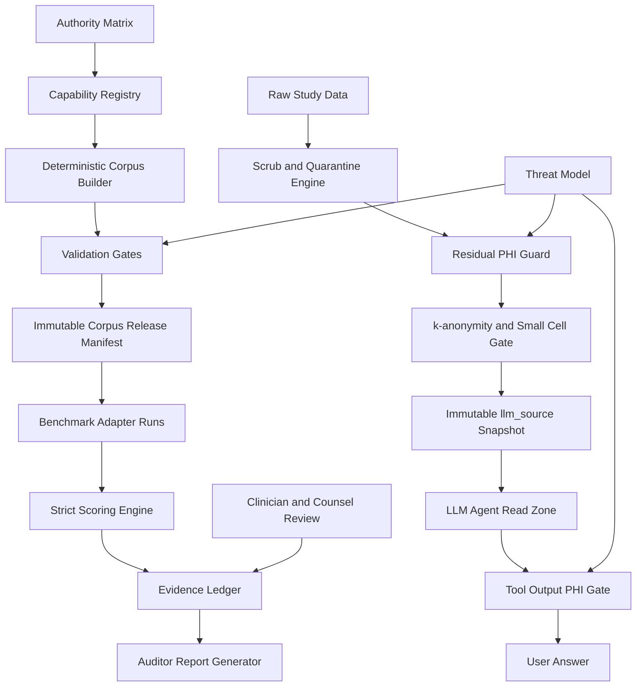

# PHI System Trust Report

**Date:** 2026-07-06  
**Project:** PHI-Handling-system  
**Report type:** Strategic risk, strengths, market differentiation, and solution report  
**Scope:** Read-only assessment of repository state, security posture, benchmark credibility, market context, and path to becoming a best-in-class AI-powered PHI safety system.  
**Verification performed:** `python -m pytest` completed with `297 passed`.  
**Files changed by this report:** this report only.

---

## Executive conclusion

The project has unusually strong foundations, but it cannot yet credibly claim to be the best, safest, or most trustworthy AI-powered PHI system.

The primary blocker is not lack of ambition. The primary blocker is **evidence mismatch**:

- Top-level claims exceed implemented and manifested artifacts.
- Critical validation and threat-model documents are missing.
- The canonical corpus path is US/HIPAA-first, not truly 10-jurisdiction.
- Benchmark scoring is useful but too lenient for market-leading claims.
- PHI/LLM safety primitives exist, but universal enforcement is not yet proven.
- External LLM, encryption, RBAC, and log/telemetry defaults are not strict enough for a highest-trust PHI claim.

The strongest path is to position the project not as another PHI detector, but as an **evidence-first PHI safety and audit platform**:

> Every claim should trace to an authority, corpus artifact, validator result, benchmark run, threat-model control, human review status, and immutable evidence ledger.

That is how this project can stand out from existing market systems.

---

## Current project truth

### What the project currently contains

The repository currently contains three overlapping systems.

#### 1. Synthetic PHI corpus and benchmark framework

This is the strongest current identity.

Observed strengths:

- Seeded corpus record model.
- Span-level gold annotations.
- Authority citation fields.
- Benchmark metrics engine.
- Presidio benchmark result artifact.
- Strong HIPAA-specific generators.

Observed limitation:

- The canonical manifest is US/HIPAA-centered. Other jurisdiction generators exist but are not fully integrated into the canonical build and manifest.

#### 2. Partial multi-jurisdiction generator suite

Generators and tests exist for multiple jurisdictions, including India, EU, Brazil, Australia, and Uganda.

However:

- README claims 10 jurisdictions.
- The canonical manifest reviewed by the architecture scout records US-only output.
- My direct corpus inventory found 606 JSONL records total: 550 US records and 56 India records.
- All checked JSONL corpus records were text format.
- Non-US generators are not yet registry-driven through the canonical release path.

#### 3. PHI runtime/scrubbing engine

`phi_engine` contains a substantial safety/runtime layer, including:

- PHI scrubber.
- HMAC pseudonymization.
- Date shifting.
- Quarantine behavior.
- Residual PHI scans.
- Audit and snapshot read barriers.
- k-anonymity/l-diversity helpers.
- AI alignment verifier.

This is valuable, but the repo identity is inconsistent:

- README says the project is not a de-identification tool.
- `pyproject.toml` describes an LLM-orchestrated PHI de-identification pipeline and benchmark framework.
- `phi_engine/security/phi_scrub.py` implements a full scrubber.

This identity drift should be fixed before external review.

---

## High-priority downsides and risks

### P0. Documentation overclaims implementation

The README claims or points to artifacts that are not present or not fully implemented.

Examples:

- 10-jurisdiction corpus.
- 13+ file formats.
- `docs/VALIDATION_PROTOCOL.md`.
- `docs/THREAT_MODEL.md`.
- `docs/REPRODUCIBILITY.md`.
- `docs/COUNSEL_REVIEW_CHECKLIST.md`.
- `docs/CLINICIAN_REVIEW_PROTOCOL.md`.
- `validators/offset_validator.py`.
- `validators/hash_validator.py`.
- `validators/taxonomy_validator.py`.
- AWS/Azure benchmark adapters.
- Membership inference framework.

Observed repository state showed those docs and validators missing, while `validators/` contained only `__init__.py`.

**Impact:** A reviewer can disprove major README claims quickly. This is the largest trust risk.

**Fix:** Introduce a capability registry and generate README status tables from it. Mark every capability as `planned`, `implemented`, `tested`, `manifested`, or `externally reviewed`.

---

### P0. Canonical corpus is not yet truly multi-jurisdiction

The repo has non-US generator work, but the canonical generation path remains US-centered.

Evidence from architecture review:

- `harness/generate_corpus.py` imports and builds HIPAA generators for the canonical path.
- `--jurisdiction all` still builds US only in the reviewed implementation.
- `corpus/MANIFEST.json` records US-only canonical output.
- India JSONL files exist but are not included in the manifest.

**Impact:** The project cannot yet claim 10-jurisdiction benchmark completeness.

**Fix:** Build a registry-driven generator orchestrator. Every implemented jurisdiction must be generated, validated, counted, hashed, and manifested.

---

### P0. Validator suite is missing

README says reviewers should rely on structural validation in `validators/`, but standalone validators are absent.

Missing or not found:

- offset validator
- hash validator
- taxonomy validator
- schema validator
- citation validator
- jurisdiction-separation validator
- file-format parse validator
- no-real-PHI static validator

**Impact:** IRB-readiness cannot rest on prose. It needs executable validation evidence.

**Fix:** Implement `harness/run_all_validations.py` and emit `validation_report.json` plus a human-readable report.

---

### P0. Threat model artifact is missing

README lists `docs/THREAT_MODEL.md`, but it was not found.

This matters because PHI plus LLMs requires explicit threat modeling against:

- prompt injection
- sensitive information disclosure
- improper output handling
- excessive agency
- vector/embedding weaknesses
- unbounded consumption
- supply-chain risks
- audit repudiation
- re-identification risk

**Impact:** Blocks credible “safest AI-powered PHI system” claims.

**Fix:** Create `docs/THREAT_MODEL.md` with assets, trust boundaries, data-flow diagrams, STRIDE analysis, OWASP LLM mapping, controls, tests, residual risks, and release gates.

---

### P0. No-PHI-to-LLM enforcement is not yet proven end to end

Security review found strong primitives but weak universal integration evidence.

Examples:

- `phi_gate_check` exists in `phi_engine/security/phi_gate.py`.
- Export/wiring comments in `phi_engine/security/__init__.py` appear inconsistent.
- Universal wrapping of all LLM-visible tools was not proven.
- Residual PHI guard exists, but active promotion enforcement needs clearer evidence.

**Impact:** One ungated tool output or promotion path can defeat the safety story.

**Fix:** Create one mandatory LLM tool wrapper and one mandatory immutable `llm_source` promotion API. Add CI tests that fail if any LLM-visible tool or promoted artifact bypasses the gate.

---

### P0. Benchmark claims are not yet market-grade

Current benchmark design is useful but not strict enough for best-in-market claims.

Issues found:

- Default Presidio benchmark uses overlap scoring.
- Default scoring is entity-type agnostic.
- Aggregate F1 is coverable-only, with structural gaps reported separately.
- Per-detection-regime precision can look misleading because false positives are not allocated to regimes.
- Current Presidio adapter injects custom MBI/VIN recognizers while reporting only `presidio-unknown`.
- Commercial/SOTA comparator runs are absent or credential/license-gated.

**Impact:** A reader could mistake a lenient or contaminated benchmark for a clean stock comparison.

**Fix:** Freeze a benchmark protocol. Primary detector metric should be strict, entity-aware, all-span F1. Structural gaps should count as misses for end-to-end detector claims. Stock and tuned baselines must be separate.

---

### P1. External LLM default posture is too permissive

`phi_engine/config/config.yaml` defaults the PHI LLM provider to `openai-oauth`, model `gpt-4o`, with base URL `http://127.0.0.1:10531/v1`.

Even if row values are not sent, header names and study metadata can reveal sensitive study structure, rare disease context, locations, or cohort information.

**Impact:** A safest PHI system should not default to a personal/local cloud proxy for PHI workflows.

**Fix:** Default to `none` or strictly local inference in PHI mode. External providers should require explicit per-study approval, documented DPA/BAA posture, outbound allowlist, and an audit entry describing what metadata leaves the system.

---

### P1. Encryption and RBAC are disabled in config

`phi_engine/config/config.yaml` sets:

- `security.encryption.enabled: false`
- `security.log_encryption: false`
- `security.rbac.enabled: false`

**Impact:** Audit logs, telemetry, quarantine, and snapshots can become secondary PHI stores. Auditability alone does not prevent unauthorized access.

**Fix:** Encrypt logs, telemetry, audit ledgers, quarantine, and snapshots at rest. Add RBAC or ABAC for operator actions.

---

### P1. Environment-variable role isolation is not enough

Several controls depend on `REPORTAL_PROCESS_ROLE == "llm-agent"`.

This is useful as a tripwire, but not a true authorization boundary.

**Impact:** [INFERENCE] If LLM-hosted code runs under the same OS user or can influence environment, role checks can be bypassed or omitted.

**Fix:** Run scrubber/publisher and LLM agent under separate Unix users or containers. Filesystem ACLs should prevent LLM role access to raw data, audit directories, quarantine, and key material.

---

### P1. Real-world validity is limited

`docs/KNOWN_LIMITATIONS.md` correctly documents:

- no real-world distribution matching
- clinician plausibility review pending
- legal counsel review pending
- file-format PHI coverage is synthetic-structural only
- quasi-identifier combinations not exhaustive
- vendor F1 claims not independently verified

**Impact:** The corpus is promising, but not enough for IRB-grade or market-leading claims without external validation.

**Fix:** Add clinician review, counsel review, hard-negative datasets, dangerous false-positive suite, and external dataset validation where permitted.

---

## Strengths and excellence opportunities

### 1. Authority-cited PHI coverage

This is the project’s strongest differentiator.

`authorities/AUTHORITY_MATRIX.md` maps identifiers across:

- HIPAA
- GDPR
- DPDPA
- ICMR
- SPDI
- DICOM
- FHIR
- Presidio
- AWS Comprehend Medical

Most systems say “we detect PHI.” This project can say:

> Every gold span traces to a primary legal, clinical, or standards authority.

That is much stronger for IRB, compliance, and institutional trust.

---

### 2. Deep HIPAA edge-case coverage

The US/HIPAA layer is unusually detailed:

- Safe Harbor
- Limited Data Set
- re-identification codes
- fundraising context
- disclosure verification
- biometric identifiers
- device UDI
- fax disambiguation
- vehicle/VIN
- quasi-identifiers

This is more sophisticated than a generic NER benchmark.

---

### 3. Deterministic corpus model

The corpus model supports:

- exact spans
- jurisdiction fields
- authority fields
- detection regimes
- seeded generation
- deterministic JSONL writes
- span verification

This is the right foundation for an auditable benchmark.

---

### 4. Gap-aware benchmark design

The metrics engine distinguishes normal misses from structural gaps.

This can become a flagship capability:

> A system should not look safe if it cannot represent a high-risk identifier category.

The project should make structural gap rate as prominent as F1.

---

### 5. Honest limitations

The limitations document is unusually candid. This is a trust asset if top-level claims are aligned with it.

The project should not hide limitations. It should productize them into a claim ladder.

---

### 6. Strong PHI runtime primitives

`phi_engine` contains controls that could become best-in-class if integrated:

- fail-closed scrub config
- HMAC pseudonymization
- deterministic date jitter
- quarantine for unsafe rows
- value-free audit findings
- audit/snapshot read barriers
- residual PHI scanners
- k-anonymity/l-diversity helpers
- AI alignment verifier

The main work is integration and evidence, not inventing controls from scratch.

---

## Market comparison

### Presidio

Presidio provides open-source identification/anonymization for text, images, and structured data. It supports predefined/custom recognizers, NER, regexes, checksums, external models, Python/PySpark/Docker/Kubernetes usage, and image redaction. Its docs warn that automated detection cannot guarantee all sensitive information will be found.

Source: https://data-privacy-stack.github.io/presidio/

**Opportunity:** Beat Presidio on authority traceability, jurisdiction-specific coverage, structural gap accounting, and audit evidence.

---

### AWS Comprehend Medical DetectPHI

AWS DetectPHI detects PHI entities and provides confidence scores. AWS recommends evaluating thresholds and using human review or other methods for compliance use cases. AWS also says entities do not map 1:1 to HIPAA Safe Harbor identifiers.

Source: https://docs.aws.amazon.com/comprehend-medical/latest/dev/textanalysis-phi.html

**Opportunity:** Preserve exact legal categories instead of collapsing many identifiers into broad buckets like `ID`.

---

### Azure Health Data Services De-identification

Azure offers managed TAG, REDACT, and SURROGATE operations, 27 PHI entities, multilingual support, HIPAA/GDPR positioning, tenant-contained stateless processing, RBAC, private endpoints, and batch/synchronous endpoints. It also has service limits, including request/document/job thresholds.

Source: https://learn.microsoft.com/en-us/azure/healthcare-apis/deidentification/overview

**Opportunity:** Azure is strong as a managed cloud service. This project can stand out as local-first, evidence-led, jurisdiction-aware, reproducible, and auditor-facing.

---

### OWASP LLM Top 10

OWASP 2025 GenAI risks include prompt injection, sensitive information disclosure, supply chain, data/model poisoning, improper output handling, excessive agency, system prompt leakage, vector/embedding weaknesses, misinformation, and unbounded consumption.

Source: https://genai.owasp.org/llm-top-10/

**Opportunity:** Become the PHI system that maps every LLM risk to a control and regression test.

---

### NIST AI RMF

NIST AI RMF is intended to improve trustworthy AI risk management. NIST also released the Generative AI Profile, NIST AI 600-1, for GenAI-specific risks.

Source: https://www.nist.gov/itl/ai-risk-management-framework

**Opportunity:** Structure trust claims around NIST AI RMF: Govern, Map, Measure, Manage.

---

### HIPAA de-identification baseline

HHS and 45 CFR 164.514 define de-identification requirements, including Safe Harbor and Expert Determination.

Sources:

- https://www.hhs.gov/hipaa/for-professionals/special-topics/de-identification/index.html
- https://www.ecfr.gov/current/title-45/subtitle-A/subchapter-C/part-164/subpart-E/section-164.514

**Opportunity:** Make every HIPAA claim traceable to a CFR subparagraph, corpus record, span, validator output, and benchmark result.

---

## Recommended solution: Evidence-First PHI Safety System

The project should become:

> The first evidence-led, jurisdiction-aware, no-PHI-to-LLM safety system for clinical AI workflows.

The product promise should be:

> We do not ask users to trust model behavior. We prove what data was allowed to reach the model, why it was allowed, which authority governed it, which validator passed it, which benchmark measured it, and what residual risk remains.

---

## Proposed architecture



---

## Required components

### 1. Capability registry

Create one machine-readable registry containing every claimed capability.

Fields:

- capability ID
- jurisdiction
- authority citation
- generator file
- corpus output path
- validator coverage
- benchmark adapter coverage
- status: planned, implemented, tested, manifested, externally reviewed
- evidence artifact links

The README should be generated from or checked against this registry.

---

### 2. Registry-driven corpus builder

Replace hard-coded US-only generation with a registry-driven builder.

Required behavior:

- `--jurisdiction all` builds every implemented deterministic generator.
- Every output is registered.
- Every span offset is validated.
- Every record has authority metadata.
- Every file hash is included.
- Manifest includes all generated artifacts.

Manifest must include:

- corpus SHA-256
- record count
- gold span count
- generator manifest
- generation date
- Python version
- dependency versions/hashes
- no-real-PHI attestation
- terminology/name sources
- per-jurisdiction counts
- per-format counts
- validation status

---

### 3. Standalone validators

Implement:

- `validators/offset_validator.py`
- `validators/hash_validator.py`
- `validators/taxonomy_validator.py`
- `validators/schema_validator.py`
- `validators/citation_validator.py`
- `validators/jurisdiction_separator.py`
- `validators/format_parse_validator.py`
- `validators/no_real_phi_static_validator.py`

Then create:

- `harness/run_all_validations.py`
- `validation_report.json`
- human-readable validation report

Release rule:

> No validation report, no IRB-ready claim.

---

### 4. Strict benchmark protocol

Define a frozen benchmark protocol before running tools.

Primary detector metric:

- strict entity-aware exact-span micro/macro F1 over all gold spans
- structural gaps count as misses for end-to-end detector claims

Secondary metrics:

- overlap F1
- coverable-only F1
- structural gap rate
- category recall
- per-jurisdiction F1
- per-file-format F1
- hard-negative specificity
- dangerous false-positive rate
- conflict-case correctness
- k-anonymity residual risk
- calibration curves where confidence exists

Separate baselines:

1. Stock Presidio
2. Tuned Presidio
3. AWS Comprehend Medical
4. Azure Health De-identification
5. John Snow Labs
6. PyDeID
7. Philter
8. CliniDeID
9. PhysioNet DeID
10. Modified Deidentify if license allows
11. Project engine/system under test

Every run must store:

- raw predictions
- normalized predictions
- tool version
- config hash
- adapter version
- command line
- corpus manifest hash
- scoring config
- output report

---

### 5. No-PHI-to-LLM boundary

Design rule:

> The LLM process can read only immutable approved `llm_source` snapshots. It cannot read raw data, staging data, audit data, quarantine data, keys, logs, or live pipeline output.

Required controls:

- separate OS user/container for scrubber and LLM agent
- filesystem ACLs, not only environment variables
- immutable snapshot manifest
- `.NO_LLM_ZONE` sentinels
- deny audit/snapshot/raw paths
- residual PHI scan before promotion
- k-anonymity/l-diversity/small-cell gates before promotion
- signed approval manifest
- no external LLM unless explicitly approved for the study
- every LLM-visible tool wrapped by mandatory PHI output gate

---

### 6. Capability-wrapped LLM tools

Every LLM-callable tool should be created through a single wrapper.

Wrapper enforces:

- allowed read roots only
- audit/snapshot/raw path denial
- output PHI gate
- small-cell suppression
- maximum output size
- timeout
- value-free logging
- no matched PHI values in errors
- no direct shell/file path actions from model output
- structured error responses

Add CI test:

> Introspect all registered LLM tools. Fail if any tool is not wrapped.

---

### 7. LLM output verifier

Never let a model directly decide `keep`.

For LLM header classification and alignment:

- output header must equal input header at same index
- action must be allowlisted
- confidence must be between 0 and 1
- PHI decisions require official citation
- high-risk `keep` requires deterministic confirmation or human review
- malformed output routes to review
- prompt-injection strings in headers must not change behavior

This addresses OWASP LLM05: model output is untrusted input.

---

### 8. Threat model as release artifact

Create `docs/THREAT_MODEL.md` with:

- assets
- trust boundaries
- data-flow diagrams
- STRIDE table
- OWASP LLM Top 10 mapping
- control inventory
- tests proving controls
- residual risk
- release gates
- owner/status for every mitigation

Release rule:

> No threat model, no “safest AI-powered PHI system” claim.

---

### 9. Clinician and counsel review workflow

For IRB trust:

- clinician plausibility review
- legal counsel review
- inter-annotator agreement
- adjudication logs
- unresolved disagreement report
- versioned signoff packet

The system should not hide human review. It should make human review efficient, auditable, and reproducible.

---

## Claim ladder

Use explicit public claim levels.

| Level | Allowed claim | Current status |
|---|---|---|
| L0 | Prototype PHI corpus and benchmark harness | Supported |
| L1 | Reproducible US/HIPAA synthetic benchmark with span-level gold annotations | Mostly supported |
| L2 | Multi-jurisdiction synthetic PHI benchmark | Partial, not fully manifested |
| L3 | File-format and adversarial PHI benchmark | Partial, not canonical |
| L4 | IRB-audit-ready benchmark with clinician/counsel review | Not yet |
| L5 | Market-leading PHI detector or safest AI-powered PHI system | Not yet |

Current repo status:

> L1 strong, L2 partial, L3 partial, L4/L5 not yet supported.

This claim ladder itself will increase trust because it prevents overstatement.

---

## How to stand out from existing market systems

### 1. Do not optimize only for F1

F1 is necessary but insufficient.

Market systems can advertise high F1 while hiding:

- structural gaps
- jurisdiction mismatch
- over-redaction harm
- lack of audit evidence
- cloud egress risk
- unclear benchmark data
- no authority mapping

This project should report a richer safety score.

Suggested trust score:

```text
PHI Safety Score =
  residual PHI miss risk
+ structural gap risk
+ dangerous false-positive risk
+ re-identification risk
+ jurisdiction conflict risk
+ audit evidence incompleteness
+ LLM exposure risk
```

Lower is better.

---

### 2. Make gap accounting first-class

A tool should not look excellent if it cannot represent VIN, MRN, device IDs, biometrics, ABHA, CTRI, or other high-risk identifiers.

Current Presidio result already exposes this:

- aggregate F1: 0.5549
- precision: 0.4257
- recall: 0.797
- gap detection rate: 0.2839
- structural gap spans: 373

The market differentiator:

> We do not hide what a tool cannot detect.

---

### 3. Measure dangerous false positives

PHI removal is not only about deleting identifiers. In clinical text, deleting the wrong non-PHI can harm meaning.

Track false positives for:

- medication names
- dosages
- allergies
- negations
- disease names
- procedure names
- critical qualifiers
- lab values
- trial arm names
- clinical outcomes

This can beat systems that over-redact aggressively.

---

### 4. Be local-first and no-egress by default

Azure and AWS are strong managed cloud services. This project can stand apart by being:

- local-first
- air-gapped compatible
- no cloud by default
- external provider explicitly attested
- row values prohibited from prompts
- LLM reads only approved clean snapshots

This is better suited for high-security clinical environments.

---

### 5. Make the audit report the product

The standout artifact should be an auditor packet:

- corpus manifest hash
- validation report hash
- threat model version
- benchmark protocol version
- raw prediction artifact links
- per-span evidence
- authority matrix version
- clinician/counsel review status
- unresolved limitations
- achieved claim level
- release decision

This is what existing market systems usually do not provide.

---

## Prioritized action plan

### Phase 1: Stop trust leakage from overclaims

Goal: make current claims honest.

Actions:

1. Rewrite README status.
2. Add capability registry.
3. Generate or check README capability tables from registry.
4. Mark missing docs as planned or create minimal accurate versions.
5. Split product identity into corpus/benchmark and optional runtime engine.

Acceptance:

- Every README claim maps to a registry row and artifact.

---

### Phase 2: Build validation spine

Goal: make corpus release auditable.

Actions:

1. Implement validators.
2. Implement `harness/run_all_validations.py`.
3. Add complete manifest builder.
4. Include implemented non-US generators only when registered.
5. Add validation reports to release artifacts.

Acceptance:

- `python -m harness.run_all_validations` produces pass/fail report.
- Manifest includes every generated corpus file.

---

### Phase 3: Fix benchmark credibility

Goal: support serious comparisons.

Actions:

1. Split stock Presidio and tuned Presidio.
2. Make strict entity-aware all-span F1 the primary metric.
3. Keep gap-aware score prominent.
4. Add hard-negative corpus.
5. Add dangerous false-positive suite.
6. Store raw predictions and config metadata.
7. Add confidence intervals.

Acceptance:

- No baseline result is accepted without raw predictions, version, config, and scoring protocol.

---

### Phase 4: Prove no-PHI-to-LLM

Goal: make safety boundary real.

Actions:

1. Implement one immutable `llm_source` promotion API.
2. Make residual PHI gate mandatory before promotion.
3. Make k-anonymity/small-cell gate mandatory before promotion.
4. Add OS/container separation plan.
5. Wrap all LLM tools through one security factory.
6. Add introspection tests for tool wrappers.
7. Disable external LLM by default in PHI mode.

Acceptance:

- Seed PHI into candidate `llm_source`; promotion fails.
- Try audit/raw/snapshot-root path read as LLM role; access denied.
- Register unwrapped tool; CI fails.

---

### Phase 5: Add threat model and security evidence

Goal: make trust architecture auditable.

Actions:

1. Create `docs/THREAT_MODEL.md`.
2. Map STRIDE and OWASP LLM Top 10 to controls/tests.
3. Add security regression tests for:
   - prompt injection
   - PHI output gate
   - log redaction
   - telemetry no raw values
   - key denial under LLM role
   - audit zone denial
   - k-anonymity failure
   - external LLM egress denial
4. Generate security evidence report.

Acceptance:

- Every threat has mitigation, test, residual risk, and owner/status.

---

### Phase 6: Independent review

Goal: move toward IRB-grade trust.

Actions:

1. Clinician plausibility review.
2. Counsel review of authority matrix and legal basis.
3. External baseline runs where credentials/licenses allow.
4. External dataset validation where permitted.
5. Signed release packet.

Acceptance:

- Claim level can move from L1/L2 toward L4.

---

## Final verdict

### Downsides

The project’s biggest downside is evidence mismatch:

- top-level claims exceed implemented artifacts
- validators and critical docs are missing
- canonical build is US-only
- benchmark methodology is too lenient for market claims
- PHI/LLM gates are promising but not proven as universal enforcement
- external LLM default posture is too permissive for a highest-safety claim
- encryption/RBAC/logging posture is not production-grade yet

### Strengths

The project has unusually strong foundations:

- authority matrix
- span-level gold annotations
- deep HIPAA edge cases
- seeded deterministic generation
- honest limitations
- working metrics engine
- concrete Presidio result
- strong PHI scrubber primitives
- value-free audit design
- passing test suite

### Best path to stand out

Do not compete as a generic PHI detector.

Compete as an auditable PHI trust system:

- safer by construction
- local-first
- no-egress by default
- authority-cited
- benchmark-reproducible
- gap-transparent
- clinician/counsel-reviewable
- LLM-risk mapped
- evidence-led

That is how the project can become the best, safest, and most trustworthy AI-powered PHI system available.

---

## Implementation status

This report has been converted into an implementation plan in the planning session; durable implementation artifacts are tracked through `harness/capability_registry.json` after execution.
