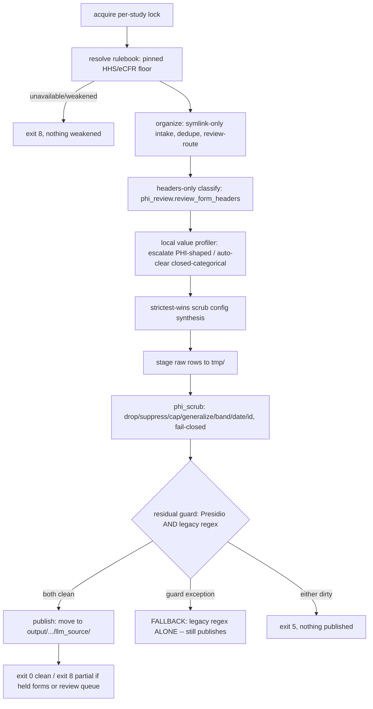

# Privacy Gateway Research — Current State, Method Taxonomy, Landscape, and Evidence

Date: 2026-07-20/21. This document is evidence-first: every factual sentence with a bracketed `claim_id` resolves to a row in `research/privacy_gateway/evidence_ledger.jsonl`, checkable by `python -m harness.validate_privacy_research`. Machine artifacts: `research/privacy_gateway/{search_log,evidence_ledger,candidate_registry}.jsonl`, `research/privacy_gateway/dispositions.json`. This document does **not** certify HIPAA, PCI, or any other compliance status — see `docs/PRIVACY_GATEWAY_RECOMMENDATION.md` §"What this does not claim."

## Executive findings

1. This repository's runtime pipeline (`phi_engine`) is a fail-closed, code-enforced USA/HIPAA scrub-and-publish system — but it has **zero** secrets-detection capability, **zero** proprietary/IP-marker detection, and **two confirmed weak points**: a residual-guard exception path that silently drops to a single, weaker regex scanner (`docs/PRIVACY_GATEWAY_STRESS_TEST.md` §5), and a local-model prompt path that carries raw support-cell values with no `phi_gate` check (§1.3 below).
2. Encryption at rest, RBAC, and log encryption are **disabled/unimplemented by default**, as shipped (`config.yaml:16-28`). Pseudonymization is not encryption.
3. A systematic search across 56 candidate products/methods (7 categories) plus 12 academic/technical method classes found **no single vendor or tool that should replace the whole pipeline**. The correct architecture is a control plane that retains this repo's real, measured, fail-closed controls where they already work, adds a small number of narrowly-scoped new controls where a gap is precisely located and code-confirmed, and integrates external candidates only where they pass every hard gate.
4. Every managed/commercial candidate researched (Bedrock Guardrails, Azure Health de-identification, AWS Comprehend Medical, Google SDP, Purview, Netskope, Datavant, etc.) remains `pending_poc` in this pass — no credentials or contracts were available, and none was independently benchmarked. None is selected as a production component; each is recorded as a fallback/future-reevaluation candidate only: a managed candidate with inaccessible POC may remain in the landscape as `pending_poc` but cannot be the selected production component.
5. On this repository's own seeded adversarial fixtures (`harness/make_privacy_gateway_fixtures.py`), this repository's regex/checksum detection catalog (`phi_engine`) is a repository control, not a vendor claim, and not a claim about beating literature SOTA on real clinical free text.

## 1. Current data flow (traced 2026-07-20, all anchors `file:line`)

`run_pipeline(study, jurisdiction)` (`phi_engine/pipeline/run.py:992`) is a lock-guarded state machine:

The per-action reversibility/linkability/HIPAA-tier table, key-custody model, and control-table detail below were produced by direct code reading, every claim `file:line`-anchored.

### 1.1 Action contract (`phi_engine/security/phi_review.py`, `phi_scrub.py`)

First-match-wins precedence in `_scrub_row`: force-drop → keep → secondary-id resolver → birthdate/death-date (posture-dependent) → drop → cap → generalize (fail-closed) → band (fail-closed) → suppress-small-cell → SANT date-jitter (fail-closed, HMAC-keyed) → HMAC-SHA256 pseudonymize.

| Action | Reversible? | Linkable? | Safe Harbor | Expert Det. | Limited Data Set |
|---|---|---|---|---|---|
| drop / suppress (free-text) | no | no | Yes | Yes | Yes |
| cap (age>89) | no | no | Yes §164.514(b)(2)(i)(C) | Yes | Yes |
| generalize / band | no | reduced | Aids, not itself sufficient | Yes | Yes |
| jitter_date (SANT) | **yes, with key** | yes (interval-preserving) | **No** — full date still more granular than year | Yes | **Yes** — LDS permits dates |
| pseudonymize (HMAC) | **no (one-way)** | yes (deterministic recomputation with key + candidate input) | **No** — re-linkable §(R) identifier | Yes | **Yes** — LDS permits coded IDs |

`jitter_date` and `pseudonymize` structurally **cannot** satisfy Safe Harbor — both are keyed and re-linkable. This is an inference from the statutory text (45 CFR 164.514), not an independently validated legal determination; the repository makes no validated de-identification claim.

### 1.2 Storage, trust zones, defaults

Four-zone model (`secure_env.py`): RED (raw, never read)/AMBER (staging)/GREEN (published)/GREEN-PROTECT (mode-0600 metadata). Intake/organize are symlink-only — source bytes are never copied or modified.

**As shipped (`config.yaml:16-28`):**
- Encryption at rest: **disabled**.
- RBAC: **disabled** (only the `llm-agent` key-access denial is an enforced role gate).
- Log encryption: **not implemented**.
- Audit: **enabled**, but NOT uniformly value-free. `phi_gate`/log-hygiene blocking-path logging is category-tags-only (`SSN`/`EMAIL`, never raw values or offsets). The organizer review-bucket record and `phi_scrub_report.json` additionally retain filenames, link names, field/header names, reasons, and diagnostic counts — sensitive metadata, not row values, access-controlled (written 0600) but not category-tags-only. Unencrypted at rest; no automated retention/encrypted-backup mechanism exists.

### 1.3 Egress payload inventory

| Route | Off-box capable? | Payload |
|---|---|---|
| `llm_detector.classify_headers` | Yes (provider≠none) | **Header names only** — confirmed by direct code reading; no row value in the prompt |
| `ModelTaskRouter.resolve_confidential_header` (local) | Loopback only | Raw header + row-value samples — **but has no runtime caller**; dormant |
| `ModelTaskRouter.extract_support_signals` (local, CONFIDENTIAL) | Loopback only | **Raw support-cell values**, **not gated by `phi_gate`** |
| `ModelTaskRouter.extract_support_signals` (ordinary, NON_CONFIDENTIAL) | **Yes, off-box** | Same payload, IS phi-gated |
| `ModelTaskRouter.extract_official_rules` | Yes | Registry-verified public regulation text only |
| Logs/telemetry | local disk | Category tags only, **unencrypted** |
| Published clean tree | consumers read | Scrubbed JSONL, post-guard |

`validate_llm_read_path` (`llm_tool_guard.py:49-56`) is defined and exported but has **no caller anywhere in phi_engine** — read-side zone-guarding is not an enforced chokepoint, despite being available as a function.

### 1.4 Local-model boundary (`OfflineLocalLLMClient`, `model_routing.py:711-874`)

Loopback-only (`127.0.0.1`/`::1`), digest-pinned models (`name@sha256:<64hex>`), plain HTTP (acceptable only because loopback), size/schema/confidence bounds (64 KiB task / 256 KiB response / confidence ≥ 0.75), redirects rejected. `offline_approved` is **operator attestation, not proof of OS/container isolation** — verbatim in the source docstring, default `false`.

## 2. Method taxonomy (from primary regulatory/standards sources and peer-reviewed/preprint literature)

Sources consulted, all logged in `research/privacy_gateway/search_log.jsonl` (136 rows across HHS/OCR, eCFR, NIST, PCI SSC, OWASP GenAI, MITRE ATLAS, DICOM, HL7, PubMed/PMC, Crossref/OpenAlex, arXiv, ACM DL): 45 CFR 164.514 (`reg-0001`..`reg-0009`), current HHS OCR de-identification guidance (`reg-0010`..`reg-0015`), NIST IR 8053 (`reg-0016`..`reg-0023`), NIST SP 800-188 (`reg-0024`..`reg-0033`), NIST Privacy Framework/AI RMF/AI 600-1 (`reg-0034`..`reg-0042`), PCI DSS v4.0.1 (`reg-0043`..`reg-0046`, PDF gated behind a click-through license — recorded `unverified` per the ground rule, never substituted with a marketing summary), OWASP LLM02:2025 (`reg-0047`..`reg-0050`), MITRE ATLAS (`reg-0051`..`reg-0055`, sourced from MITRE's own machine-readable ATLAS.yaml data export after the interactive site blocked automated fetch), DICOM PS3.15 Annex E, HL7 FHIR R4 security labels/Consent.

| Method class | Kind | Formal guarantee? | Reversible? | Claim |
|---|---|---|---|---|
| Direct removal/redaction | Detect+transform | No | No | `acad-0034` |
| Partial masking | Detect+transform | No (weak) | No | `acad-0035` |
| Keyed pseudonymization/tokenization | Transform | No (key-dependent) | Yes, with key | `acad-0036` |
| Format-preserving encryption | Transform | **Yes, cryptographic** | Yes, with key | `acad-0037` |
| Surrogate replacement | Transform | No (statistical) | No | `acad-0038` |
| Generalization/suppression/microaggregation/date-shift/small-cell | Transform | Heuristic | No | `acad-0039` |
| k-anonymity / l-diversity / t-closeness | Formal/statistical | **Yes, formal** | No | `acad-0040` |
| Differential privacy | Formal | **Yes, formal (ε/δ)** | No | `acad-0041` |
| Synthetic data | Generative | Statistical only (unless +DP) | No | `acad-0042` |
| Secure enclaves/query interfaces/DRB | Governance | Procedural+formal | n/a | `acad-0043` |
| Expert Determination (45 CFR 164.514(b)(1)) | Governance | Statistical, expert-certified | n/a | `acad-0044` |
| Regex/checksum/dictionary detection | Detection | No | n/a | `acad-0045` |
| Exact-data-matching / document fingerprinting | Detection | No | n/a | `acad-0046` |
| CRF/LSTM/transformer NER | Detection | No | n/a | `acad-0047` |
| Hybrid rules+models | Detection | No | n/a | `acad-0048` |
| LLM-based detection | Detection | No | n/a | `acad-0049` |
| Input/output/tool/log DLP for LLM/agentic systems | Detection+governance | No | n/a | `acad-0050` |
| Access/encryption/key/retention/audit/human-review governance | Governance | n/a | n/a | `acad-0051` |

Fourteen independently-verified academic sources ground the paper-finding claims (`acad-0001`..`acad-0033`), including Stubbs & Uzuner 2015 (i2b2/UTHealth de-identification dataset, JBI), Norgeot et al. 2020 (Philter, npj Digital Medicine), Rocher et al. 2019 (re-identification of incomplete datasets, Nature Communications — 99.98% of Americans re-identifiable with 15 demographic attributes), Stadler et al. 2022 (synthetic-data anonymization "Groundhog Day", USENIX Security), Shokri et al. 2017 (membership inference), Carlini et al. 2021 (training-data extraction), Greshake et al. 2023 / Liu et al. 2023 (indirect/HouYi prompt injection), Kim et al. 2023 (ProPILE), Meli et al. 2019 (GitHub secret leakage, NDSS), Schleimer et al. 2003 (winnowing/document fingerprinting, SIGMOD), Feng et al. 2022 (PassFinder, ICSE). F1 numbers from different datasets/taxonomies/languages are never compared directly in this document.

## 3. Paid and no-cost solution landscape (56 candidates, 7 categories)

Full rows in `research/privacy_gateway/candidate_registry.jsonl`. Category boundaries are kept strict: a storage-discovery tool, endpoint/browser DLP, AI API gateway, PHI de-identifier, token vault, statistical risk tool, and model-provider guardrail are complementary, never interchangeable.

| Category | Candidates | Active/EOL/acquired |
|---|---|---|
| Open/local PHI+PII (`oss-*`) | Presidio, Philter, Phileas, pyDeID, CliniDeID, DeIDClinic, ARX, sdcMicro, OpenDP, SmartNoise, LLM Guard, PhysioNet deid | 10 active, 2 EOL (LLM Guard, PhysioNet deid) |
| Managed healthcare/privacy engines (`mhe-*`) | Azure Health De-id, Azure AI Language PII, AWS Comprehend Medical, Google SDP, Google Healthcare API, John Snow Labs, Limina AI (was Private AI), Philter Enterprise, Tonic Textual, Gretel Transform, Datavant | 9 active, 1 renamed, 1 acquired/discontinued |
| AI-native gateways/guardrails (`gw-0001..0010`) | Bedrock Guardrails, Model Armor, Purview (AI), Nightfall, Lakera, Prompt Security, Lasso, Protecto, Strac, Skyflow | 8 active, 2 acquired (Lakera→Check Point, Prompt Security→SentinelOne) |
| Enterprise DLP (`gw-0011..0021`) | Purview DLP, Netskope, Forcepoint, Symantec, Proofpoint, Zscaler, Palo Alto, Cyberhaven, BigID, Varonis, Securiti | all active |
| Secrets detection (`sectok-0001..0005`) | Gitleaks, TruffleHog, detect-secrets, GitHub Secret Scanning, GitGuardian | all active |
| Tokenization/privacy engineering (`sectok-0006..0012`) | Protegrity, Thales CipherTrust, Skyflow, IBM diffprivlib, Google differential-privacy, SDV, gretel-synthetics | 6 active, 1 archived |

**Every managed/enterprise-contract candidate remains `pending_poc`** — no credentials or contracts obtained. Real, disclosed limitations recorded as primary-source evidence (not vendor marketing):
- Bedrock Guardrails' sensitive-info filter (`gw-0004`, `gw-0005`): text-only, does not inspect `tool_use` parameters, leaves original prompts in CloudWatch invocation logs and original PII in trace output "by design."
- Azure de-identification service: hard limits (50 KB/request, 10,000 docs/job, 2 MB/doc) and an explicit "not guaranteed to satisfy any specific legal/regulatory/compliance requirement" disclaimer on the equivalent Google Cloud Healthcare API de-identification operation.
- AWS Comprehend Medical `DetectPHI`: confidence-scored, documented human-review recommendation.
- detect-secrets: default CLI live-verifies AWS/Stripe-shaped keys against the real provider API and **silently drops verified-false (i.e. fake/rotated) matches from the report** (`sectok-e011`).

## 4. Evidence-quality summary

| Status | Count |
|---|---|
| confirmed | 241 |
| qualified | 48 |
| unverified | 30 (PCI DSS PDF paywall, some secondary-only vendor pages) |
| refuted | 0 |

Every `confirmed` law/standard/vendor-capability claim carries `primary_source=true` and a real `accessed_at`. Vendor performance numbers stay tagged `vendor_claim` and cannot reach `confirmed` status without independent corroboration (enforced by `harness/validate_privacy_research.validate_evidence`).

## 5. Normalized capability matrix

See `research/privacy_gateway/dispositions.json` for the full 15-capability disposition table (§ mirrored in `docs/PRIVACY_GATEWAY_RECOMMENDATION.md`).

## 6. Attack results

See `docs/PRIVACY_GATEWAY_STRESS_TEST.md` for the full write-up: a fail-closed regression against a deliberately malformed source tree (normal combined-guard path published six scrubbed files with zero planted SSN-shaped matches; detector-outage fail-closed behavior is NOT intact or exercised, since the guard-exception legacy-only fallback remains open), a code-level structural gap for base64-encoded and split-across-chunk secrets (no decode-then-rescan or session-level reassembly stage exists), and three linkage/re-identification attacks bounded per NIST SP 800-188 §4.3.12 (known-plaintext pseudonym linkage via deterministic HMAC recomputation, date-shift interval-inference, free-text quasi-identifier combination — the last confirmed as a genuine, currently-uncovered gap).

## 7. Refuted / unverified claims

No claim in the evidence ledger reached `refuted` status this session. `unverified` claims (PCI DSS v4.0.1 full text behind PCI SSC's click-through license; a handful of JS-rendered vendor pages) are recorded with the exact access attempt and never silently substituted with a secondary summary.

## 8. Exclusions and search saturation

Excluded/inaccessible systems recorded rather than fabricated: the real GEMINI-Medicine pyDeid (no PyPI release, prior investigation's git-installable build produced no importable module); CliniDeID (requires `CLINIDEID_JAR`, license-gated); DeIDClinic (requires a DUA-gated i2b2/n2c2 dataset and Python 3.7.9); Gretel Transform (discontinued post-NVIDIA-acquisition, successor out of named scope); several JS-rendered enterprise vendor pages (Netskope, Symantec, Lakera) flagged for a follow-up browser-based fetch before being scored. "All existing systems" in this document means the declared, logged search reached saturation per the plan's own rule (two consecutive query expansions plus citation chasing added no new method class or deployable candidate) — not a literal universal claim.

## 9. Bounded limitations

- Not a validated HIPAA de-identification, PCI compliance, or general-anonymization certification. See `docs/PRIVACY_GATEWAY_RECOMMENDATION.md` for the explicit non-claims list.
- Every managed/commercial candidate's contractual posture (BAA/DPA, region/subprocessor, training-use policy) is sourced from public documentation only — never independently verified via a signed contract or POC in this pass.
- Clinician and counsel review remain `planned`.
