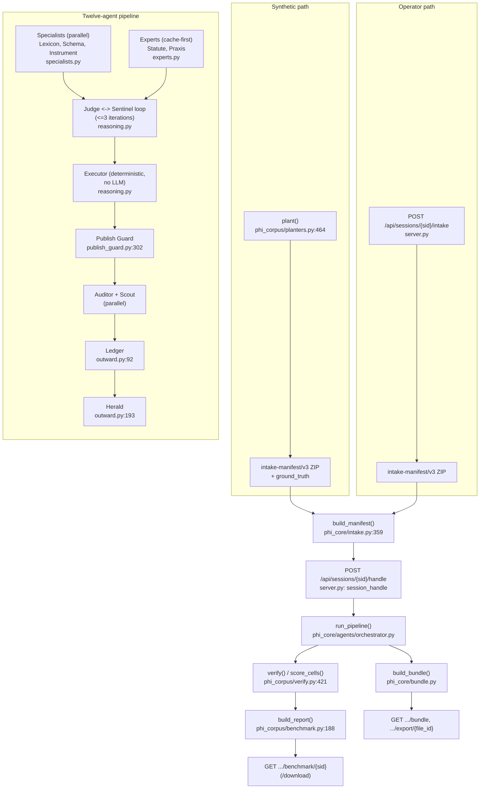

# ARCHITECTURE - PHI Console

**Status:** Reference document. Read alongside `GOAL.md` (operational spec) and `VISION.md`
(north star). Written 2026-08-13 against the code as it exists after the production-hardening
pass; regenerate the numeric anchors below whenever a cited file moves materially.

---

## 1. End-to-end flow

Two entry paths converge on the same twelve-agent pipeline: an operator uploading a real study
ZIP, and the corpus generator producing a synthetic one for benchmarking. Both produce the same
intake-manifest/v3 ZIP shape and are handled identically from intake onward.



### Hop by hop

1. **Corpus generation** (synthetic path only): `phi_corpus.planters.plant(scenario_id, ...)`
   plants known-value PHI into a `Scenario` + `EdgeCase` bag, writes `datasets/*.csv` and
   `dictionary/columns.csv` into a ZIP, and returns a `CorpusArtifact` (`zip_bytes`,
   `ground_truth`, `ground_truth_summary`). Driven by `server.py`'s `corpus_study_generate` /
   `corpus_study_run` handlers.
2. **Intake**: `phi_core.intake.build_manifest(study_id, zip_path, workspace_root)` unpacks the
   ZIP under guards (path traversal, symlinks, per-file size cap, compression-ratio bomb guard,
   total-size and entry-count caps: `intake.py:149-239` `unpack_zip`, symlink check on
   classified entries at `intake.py:254-261`), classifies every entry into
   `datasets/`, `forms/`, `dictionary/`, or `_unclassified`, and returns exit code 0 (ready), 8
   (review required), or 2 (failed). `server.py`'s `session_intake` handler drives this.
3. **Pipeline launch**: `POST /api/sessions/{sid}/handle` (`server.py`: `session_handle`) claims
   the session, hydrates dataset column headers (never row values) via
   `phi_core.file_readers.read_csv_columns` / `read_xlsx_columns` / `read_parquet_columns`,
   enforces the per-study column cap (`_enforce_column_cap`), then calls
   `phi_core.agents.orchestrator.run_pipeline`.
4. **Specialists** (parallel): `Lexicon` (dictionary text, scrubbed before the prompt),
   `Schema` (dataset column headers only, never a row value), `Instrument` (PDF form text,
   scrubbed before the prompt). All three in `specialists.py`.
5. **Experts** (cache-first, fired concurrently with Specialists): `Statute` (jurisdiction
   rulebook) and `Praxis` (per-HIPAA-category transformation technique, one web-search call per
   category run under `asyncio.gather`). Both in `experts.py`.
6. **Judge <-> Sentinel loop** (`reasoning.py`, up to `iteration_cap` rounds, default 2): `Judge`
   proposes a `{file_id, column, phi_category, subject, action, reason, confidence, citation}`
   decision per column. `validate_decisions` coerces it into the executable vocabulary,
   `apply_sentinel_hard_rules` force-corrects obvious direct identifiers, `Sentinel` reviews for
   zero-leak. Unresolved disagreement past the cap becomes `human_review`.
7. **Executor** (`reasoning.py`, `PROMPT = ""`, no LLM call ever): applies each approved
   decision's transform (`_apply_action`) to every dataset cell, formula-injection-escapes the
   written value, and writes the redacted export files.
8. **Publish Guard** (`publish_guard.py:302`, `scan_all_exports`): deterministic last-mile
   regex/Presidio scan of every exported file. A run cannot report `complete` unless this scan
   is `clean`.
9. **Auditor + Scout** (parallel): `Auditor` verifies Executor's output matches Judge's
   decisions and computes metrics; `Scout` compiles a competitive landscape (no PHI in scope).
10. **Ledger** (`outward.py:92`): comparative benchmark narrative, built from two smaller LLM
    calls (`LedgerCompare`, `LedgerAggregate`).
11. **Herald** (`outward.py:193`): manuscript draft, built from two parallel LLM calls
    (`HeraldAbstract`, `HeraldSections`).
12. **Bundle + benchmark**: `phi_core.bundle.build_bundle` assembles the shareable ZIP
    (`safe_to_share/` plus, when requested, `publication/`) and signs the attestation.
    `phi_corpus.verify.verify` / `score_cells` grade the run against planted ground truth (corpus
    runs only); `phi_corpus.benchmark.build_report` turns that into the per-dataset benchmark
    report (markdown, JSON, CSV, three PNGs).

Twelve top-level agents total: Lexicon, Schema, Instrument, Statute, Praxis, Judge, Sentinel,
Executor, Auditor, Scout, Ledger, Herald. `Ledger` and `Herald` are each a small driver class
wrapping two internal sub-agent LLM calls; those four sub-agents are not counted separately.

---

## 2. The four data contracts

### 2.1 Ground truth (`CorpusArtifact.ground_truth`, `planters.py:528`)

```
scenario_id, jurisdiction, row_count, edge_case_tags, seed, corpus_version, tier, profile,
planted: [PlantedCell.to_dict(), ...],
columns: [{file_name, column, hipaa_category, expected_action, sensitivity_class}, ...],
dictionary_drift: {undocumented_columns: [...], phantom_columns: [...]},
```

Each `PlantedCell` (`planters.py:160`): `file_name, row, column, value, hipaa_category,
expected_action, edge_case_tag, plant_id, tier, expectation (ExportExpectation|None),
leak_literals, link_group, difficulty_note, sensitivity_class`.

### 2.2 Decision dict (Judge output, validated shape, `reasoning.py:40` `validate_decisions`)

```
file_id, column, phi_category, subject, action, reason, confidence, citation
```

`action` is constrained to the executable vocabulary in `ACTION_TYPES`
(`keep|drop|cap_age_90|year_only|zip3_truncate|hash|pseudonymize|scrub_text|human_review`); any
other proposed value is coerced to `human_review` and recorded as a rejection rather than
reaching `_apply_action`, which raises `ValueError` on an unhandled action instead of passing a
value through.

### 2.3 Verify report (`phi_corpus.verify.verify`, `verify.py:421`)

Base shape (always present): `scenario_id, jurisdiction, edge_case_tags, tier, correctness
{overall_precision, overall_recall, overall_f1, overall_accuracy, per_category, false_positives,
false_negatives}, deferral {rate, count, excluded_count, cells}, summary {planted_columns,
matched, tp, fp, fn, tn}, guard_status`.

When `export_paths` is supplied, also: `leak {status, hit_count, hits}, transform {conformant,
nonconformant, rate, violations}, utility {preserved, destroyed, rate, losses}, regulation
{planted, neutralised, leaked, unplanted} (keyed by HIPAA letter A-R plus NONE/QUASI),
per_tier`.

### 2.4 Benchmark report (`phi_corpus.benchmark.build_report`, `benchmark.py:188`)

```
meta, columns: [per-column {method, why, how, confidence, verdict, ...}, ...],
totals (leak rate, method-exact rate, autonomy rate, phi_cells_leaked, guard_status),
regulation (from the verify report), calibration, context_hygiene
(literals_found_in_prompts, prompts_audited), differentiation, unavailable
```

---

## 3. No-raw-identifier invariant: enforcement points

| Point | File:line | What it guarantees |
| --- | --- | --- |
| Schema agent prompt | `specialists.py` `Schema.PROMPT` | Reads dataset column headers only; the prompt text forbids row values and nothing in the call path ever loads a row into the Schema call. |
| Dataset row reads | `phi_core/file_readers.py` | `read_csv_columns`/`read_xlsx_columns`/`read_parquet_columns` return headers (+ row count), never row values; row values are read only later, in-process, by the Executor and the deterministic detectors. |
| Dictionary text before prompt | `specialists.py:44` (`Lexicon`) | `scrub_for_prompt(text[:8000])` runs the Presidio + regex detector over the dictionary text and replaces every identifier span with a category token before the Judge/Lexicon prompt is built. |
| Form text before prompt | `specialists.py:123` (`Instrument`) | Same `scrub_for_prompt` call, `text[:6000]`, over PDF form text. |
| Keep-decision re-check | `reasoning.py:197` `verify_keep_decisions` | Re-checks every `keep` decision against the real cell values in-process (not via the model); an injected instruction that tricks a model into proposing `keep` on an identifier column cannot survive this check. |
| Unknown model action | `reasoning.py:40` `validate_decisions`, `reasoning.py` `_apply_action` | An action outside the executable vocabulary is coerced to `human_review`, never executed; `_apply_action` raises `ValueError` if an unvalidated action ever reaches it. |
| Export-time last mile | `publish_guard.py:302` `scan_all_exports` | Deterministic regex/Presidio scan of every byte actually written to an export file; a run cannot report `complete` unless this is `clean`. |
| Prompt capture (corpus runs only) | `reasoning.py` (Judge/Lexicon/Instrument call sites) | The exact scrubbed prompt text sent to a model is captured onto the session for corpus runs, which is what `context_hygiene.literals_found_in_prompts` in the benchmark report is computed from. |

---

## 4. Deterministic-versus-LLM boundary

An LLM may **advise**: which HIPAA category a column belongs to, which action fits it, whether
a prior decision needs revision, what the current recommended de-identification technique is
for a category, and free-text narrative (competitive landscape, manuscript draft).

Only deterministic code **decides**:
- Which action actually executes on a cell (`_apply_action`, gated by `validate_decisions` and
  `apply_sentinel_hard_rules`).
- Whether a `keep` decision survives (`verify_keep_decisions` re-checks the real cell value).
- Whether an export is safe to hand out (`scan_all_exports`, the Publish Guard).
- Whether a run is allowed to report `complete` (guard-clean status gate in the orchestrator).
- Whether an unresolved deferral blocks the export (`human_review` decisions are never silently
  applied; the Executor refuses to run past one).
- The pseudonym/hash values themselves (`PseudonymRegistry`, HMAC-keyed by a server-held
  secret; a model never sees or produces the mapping).

---

## 5. Production configuration matrix

Full variable-by-variable documentation with generation commands lives in
`backend/.env.example`; this is the boot-blocking summary. `PHI_ENV != "dev"` (default:
`production`) makes `_refuse_to_boot_insecure` (`server.py`) collect every violation below
before raising, so a misconfigured production boot fails loudly and completely rather than
partially.

| Variable | Production requirement | What refuses to boot / operate without it |
| --- | --- | --- |
| `PHI_ENV` | `production` (the default) | Governs every other check in this table; `dev` disables all of them for local convenience. |
| `API_TOKENS` (or legacy `API_TOKEN`) | At least one `name:token` pair | `_refuse_to_boot_insecure`; without it every request would be treated as principal `"dev"`. |
| `CORS_ALLOWED_ORIGINS` | Exact origin list, never containing `*` | `_refuse_to_boot_insecure`. |
| `MONGO_URL` | Must contain `@` (authenticated) | `_refuse_to_boot_insecure`. |
| `APP_ENCRYPTION_KEY` | Base64 Fernet key | `_refuse_to_boot_insecure`; also `crypto._load_or_create_key` raises directly if reached with this unset outside dev. |
| `ATTESTATION_SIGNING_KEY` | Base64 PKCS8 Ed25519 private key | `_refuse_to_boot_insecure`; without it a production bundle would ship an unsigned attestation, which is only tolerated in dev. |
| `DATA_DIR` | Any writable path | `phi_core/paths.py` creates `uploads/`, `exports/`, `chatgpt/` under it with mode `0700` on every boot. |
| `RETENTION_DAYS` (default 30) | n/a | Governs the hourly purge loop; not boot-blocking. |
| `MAX_CONCURRENT_PIPELINES` (default 2) | n/a | Admission-control cap; not boot-blocking, but a low value under real load surfaces as 429s. |
| `MAX_COLUMNS_PER_STUDY` (default 500) | n/a | Refuses an oversized study before an unbounded Judge prompt is built. |
| `FORWARDED_ALLOW_IPS` (default `127.0.0.1`, read by the Docker image's CMD) | Reverse proxy's address when one is in front | If wrong, rate-limit buckets (4.20) either don't reflect real client IPs (too narrow) or trust a spoofable header (too wide). |

Provider credentials (`ANTHROPIC_API_KEY`, `OPENAI_API_KEY`,
`GEMINI_API_KEY`/`GOOGLE_API_KEY`, `OPENROUTER_API_KEY`): at least one must be set for the
pipeline to run at all, but none is individually boot-blocking, since the operator may connect
a ChatGPT OAuth account instead.

---

## 6. Threat model

Five trust boundaries carry untrusted data into this system.

| Boundary | Untrusted input | Threat | Control |
| --- | --- | --- | --- |
| HTTP API | Any request | Spoofing, elevation of privilege | Refuses to boot without a token in production (`_refuse_to_boot_insecure`); every owner-scoped route resolves an identity via `resolve_principal` and filters by `owner`; rate limits on the routes that take a raw credential or burn provider spend. |
| Intake ZIP | Operator-supplied archive and every file inside it | Tampering, denial of service | Path traversal, symlink, per-file-size, compression-ratio, total-size, and entry-count guards (`intake.py:149-239`, `intake.py:254-261`); legacy `.xls` refused outright rather than silently parsing to an empty dictionary. |
| Model output | Judge, Sentinel, Praxis, Lexicon, Instrument JSON replies | Elevation of privilege, information disclosure | Every proposed action validated against the executable vocabulary and fail-closed to `human_review`; `_apply_action` raises on an unhandled action rather than passing a value through; an LLM timeout is tracked (`call_failures`) and forces human review rather than silently degrading. |
| Model input | Dictionary and form text placed in prompts | Information disclosure, prompt injection | Deterministic redaction (`scrub_for_prompt`) before the prompt is built; `verify_keep_decisions` re-checks every `keep` against real cell values so an injected instruction cannot turn an identifier column into a keeper; the per-study column cap bounds prompt size. |
| Export boundary | Files handed to a third party | Information disclosure | Publish Guard scans every export byte; a scan of zero files cannot certify "clean"; a guard-blocked run cannot report `complete`; pseudonyms are keyed by a server-held secret, never reproducible from the bundle; the attestation is Ed25519-signed. |

Repudiation was the weakest boundary before 4.2/4.3: the reviewer identity on an attestation
was a free-text field any caller set. It is now sourced from the resolved principal
(`server.py`: `session_human_review`, `reviewer = principal`), not from request body text.
